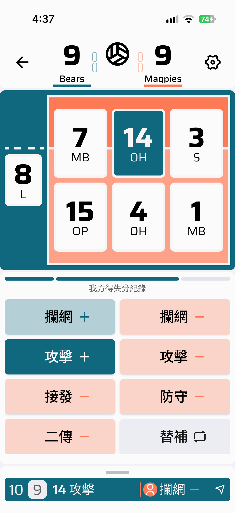
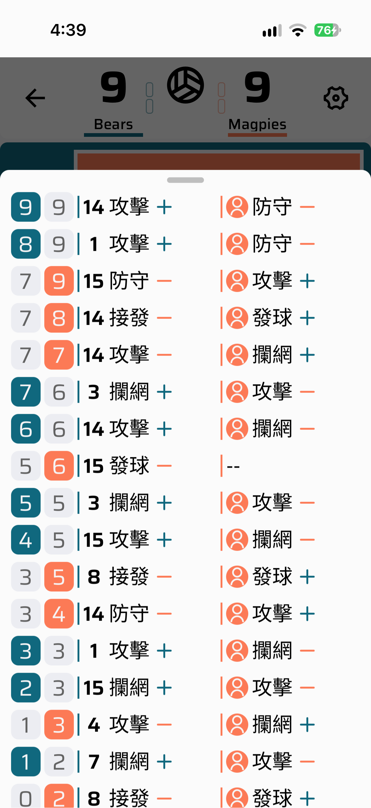
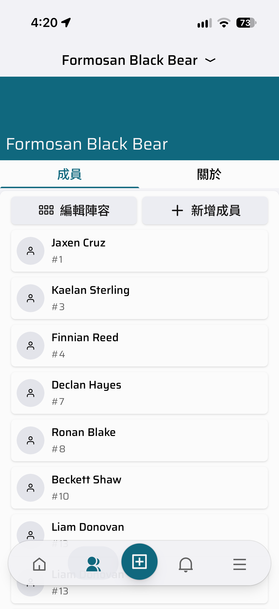
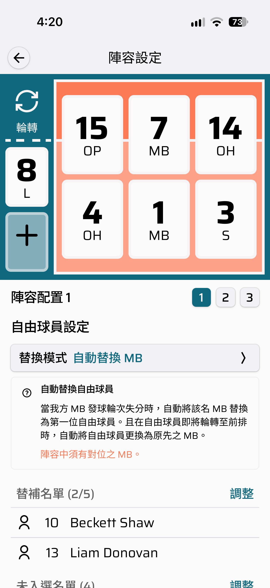
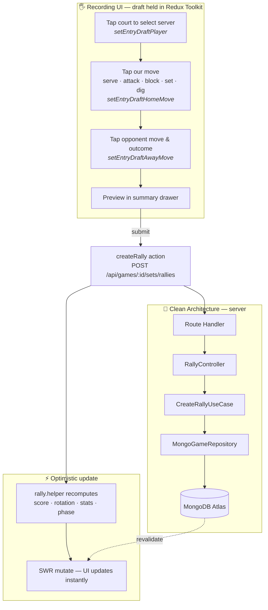
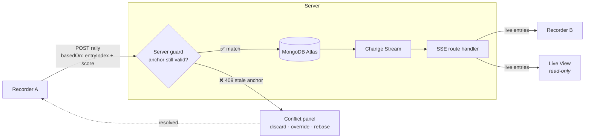
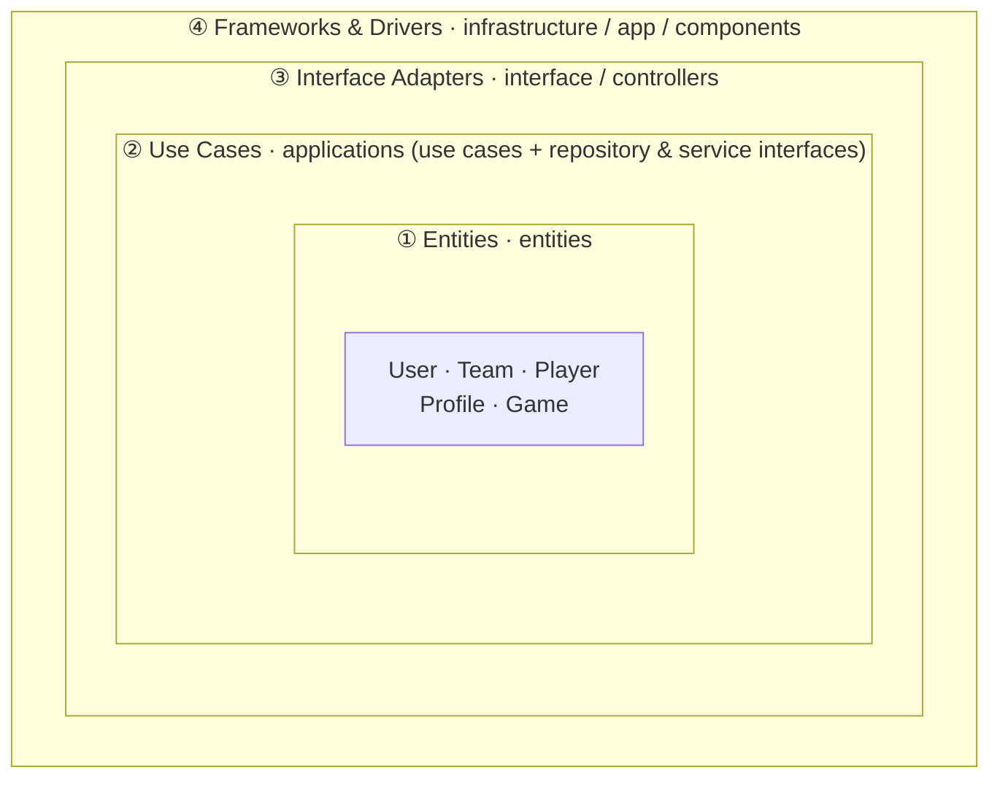

<a id="readme-top"></a>
<div align="center">

# VolleyBro

**Rally-by-rally volleyball match recording and team management, built for the sideline.**

[![Next.js][nextjs-badge]][nextjs-url]
[![React][react-badge]][react-url]
[![TypeScript][typescript-badge]][typescript-url]
[![MongoDB][mongodb-badge]][mongodb-url]
[![Tailwind CSS][tailwind-badge]][tailwind-url]

[![CI][ci-badge]][ci-url]
[![Version][version-badge]][changelog-url]

[**Live App**](https://volleybro.vercel.app/) · [**Blueprint**][blueprint-url] · [**Component Library**](https://dev--67bbfeabbc72894ce5eb92db.chromatic.com) · [**Report a Bug**][issues-url] · [**Discussions**][discussions-url]

📖 **[繁體中文](./README.zh-TW.md)**

</div>

<details>
<summary><b>Table of Contents</b></summary>

- [VolleyBro](#volleybro)
  - [About The Project](#about-the-project)
  - [Key Features](#key-features)
    - [🏐 Match Recording](#-match-recording)
    - [📊 Match Analysis](#-match-analysis)
    - [👥 Team Management](#-team-management)
    - [📱 Native-Feeling PWA](#-native-feeling-pwa)
  - [How It Works](#how-it-works)
    - [Recording a Rally](#recording-a-rally)
    - [Sync \& Live View (Planned)](#sync--live-view-planned)
  - [Architecture](#architecture)
  - [Getting Started](#getting-started)
    - [Prerequisites](#prerequisites)
    - [Installation](#installation)
  - [Development](#development)
  - [Contributing](#contributing)
  - [License](#license)
  - [Contact](#contact)

</details>

## About The Project

Recording a volleyball match on paper means a coach is writing instead of coaching. VolleyBro replaces the scoresheet with a tap-driven interface designed to keep up with live play: every rally is three taps, statistics accumulate as you go, and the whole thing works on the phone already in your pocket.

It is a Progressive Web App — installable, offline-capable, and equally usable on a phone at the net or a laptop reviewing footage afterwards.

**Built with:**

| Layer     | Technology                                                                  |
| --------- | --------------------------------------------------------------------------- |
| Framework | Next.js 16 (App Router) · React 19 · TypeScript 6                           |
| UI        | Tailwind CSS 4 · Shadcn/UI (Radix) · Motion · Recharts                      |
| State     | Redux Toolkit (recording UI) · SWR (server state) · React Hook Form (forms) |
| Backend   | MongoDB Atlas · Mongoose · InversifyJS (DI)                                 |
| Auth      | Better Auth with Google OAuth                                               |
| PWA       | Serwist (`@serwist/turbopack`)                                              |
| Quality   | Jest · React Testing Library · Storybook · ESLint · Prettier                |

<p align="right">(<a href="#readme-top">back to top</a>)</p>

## Key Features

### 🏐 Match Recording

Three taps per rally — pick the server, log your side's action, log the opponent's response. Scores, rotation, and per-skill statistics update as you record. Substitutions are recorded inline without leaving the flow.

<div align="center">
  
  
</div>

### 📊 Match Analysis

Team statistics broken down by skill — serving, blocking, attack, reception, defense, setting, and unforced errors — plus set-by-set scoring and a full rally timeline for any past match.

### 👥 Team Management

Create a team, invite members by user search, and manage roles (`OWNER` / `ADMIN` / `MEMBER`). Members move through an explicit invitation lifecycle (`NONE` → `INVITED` → `JOINED`), and lineups are configured per match.

<div align="center">
  
  
</div>

### 📱 Native-Feeling PWA

Installable with platform-specific splash screens, tab-based navigation with independent scroll state, pull-to-refresh, and overlay modals via parallel routes. Dark mode included.

<p align="right">(<a href="#readme-top">back to top</a>)</p>

## How It Works

### Recording a Rally

A single rally moves through three tap-driven steps held in Redux as a draft, then travels down the Clean Architecture stack on submit. SWR applies the result optimistically so the UI never waits on the network.



Set and match completion are **derived, not stored** — a server-side fold over the append-only entry list decides whether a set is still in progress, at set point, or won (25 points with a two-point lead; 15 in a deciding set). Nothing has to be manually closed out.

### Sync & Live View (Planned)

Multiple people often record the same match, and teammates want to follow along. The designed architecture uses HTTP POST for writes and Server-Sent Events for fan-out, with an **intent anchor** to make concurrent recording safe.

> [!NOTE]
> This section describes an agreed design that is **not yet implemented**. See the [Blueprint][blueprint-url] for current feature status.



The anchor is the state a recorder saw _when they started typing_, not when they hit send. That distinction matters: without it, an SSE update landing mid-input would make the client believe it is writing the next rally when the server already has one at that position. A stale anchor returns `409` and opens a blocking conflict panel rather than silently overwriting a teammate's work.

<p align="right">(<a href="#readme-top">back to top</a>)</p>

## Architecture

VolleyBro follows Clean Architecture: concentric layers where **source-code dependencies point only inward**. An inner layer knows nothing about the layers around it.



Crossing a boundary inward uses **dependency inversion**: the Use Cases layer declares repository and service _interfaces_, the infrastructure layer implements them, and InversifyJS injects the concrete implementation at runtime — so the domain and use cases stay free of MongoDB, Next.js, or auth details.

```txt
src/
├── entities/         # Domain layer — User, Team, Player, Profile, Game
├── applications/     # Application layer
│   ├── usecases/     #   Business use cases (CreateGame, CreateRally, …)
│   ├── repositories/ #   Abstract data-access interfaces
│   └── services/     #   Abstract external-service interfaces
├── interface/        # Interface layer — controllers orchestrating use cases
├── infrastructure/   # Infrastructure layer
│   ├── db/           #   Mongoose schemas & repository implementations
│   ├── services/     #   Authentication & authorisation
│   └── di/           #   InversifyJS container
├── app/              # Presentation — Next.js App Router (pages, layouts, API routes)
├── components/       # Presentation — React components by domain
├── lib/              # Client-side state, actions, helpers, hooks
└── hooks/            # Shared React hooks
```

Further reading: [`docs/architecture.md`](./docs/architecture.md) · [`docs/design-system.md`](./docs/design-system.md) · [`docs/testing-strategy.md`](./docs/testing-strategy.md)

<p align="right">(<a href="#readme-top">back to top</a>)</p>

## Getting Started

### Prerequisites

- **Node.js** `>=22`
- **pnpm** (the repo pins a version via `packageManager`; `corepack enable` will pick it up)
- A **MongoDB** connection string and **Google OAuth** credentials

### Installation

1. Clone the repository

   ```bash
   git clone https://github.com/AndrewCK24/volleybro.git
   cd volleybro
   ```

2. Install dependencies

   ```bash
   pnpm install
   ```

3. Create `.env.local` in the project root

   ```env
   AUTH_GOOGLE_ID=your_google_client_id
   AUTH_GOOGLE_SECRET=your_google_client_secret
   MONGODB_URI=your_mongodb_connection_string
   ```

4. Start the development server

   ```bash
   pnpm dev
   ```

   Open [http://localhost:3000](http://localhost:3000).

<p align="right">(<a href="#readme-top">back to top</a>)</p>

## Development

```bash
pnpm dev          # Development server
pnpm build        # Production build
pnpm test         # Test suite
pnpm test:watch   # Tests in watch mode
pnpm storybook    # Component workshop on :6006
pnpm verify       # format:check + typecheck + lint + test
pnpm verify:all   # verify + app build + service-worker assertion + blueprint build
```

`pnpm verify` is the gate to run before committing; `pnpm verify:all` before opening a pull request.

<p align="right">(<a href="#readme-top">back to top</a>)</p>

## Contributing

See [CONTRIBUTING.md](./CONTRIBUTING.md) for branch naming, commit conventions, code style, and testing requirements.

<p align="right">(<a href="#readme-top">back to top</a>)</p>

## License

All rights reserved. See [LICENSE](./LICENSE) for the full terms.

<p align="right">(<a href="#readme-top">back to top</a>)</p>

## Contact

- 💬 **[Discussions][discussions-url]** — general questions, ideas, and help
- 🐛 **[Issues][issues-url]** — bug reports and feature requests
- 🛡️ **[Security advisories](https://github.com/AndrewCK24/volleybro/security/advisories/new)** — please report vulnerabilities privately rather than opening a public issue

<p align="right">(<a href="#readme-top">back to top</a>)</p>

<!-- Badge definitions -->

[nextjs-badge]: https://img.shields.io/badge/Next.js-16-000000?style=for-the-badge&logo=nextdotjs&logoColor=white
[nextjs-url]: https://nextjs.org/
[react-badge]: https://img.shields.io/badge/React-19-61DAFB?style=for-the-badge&logo=react&logoColor=black
[react-url]: https://react.dev/
[typescript-badge]: https://img.shields.io/badge/TypeScript-6-3178C6?style=for-the-badge&logo=typescript&logoColor=white
[typescript-url]: https://www.typescriptlang.org/
[mongodb-badge]: https://img.shields.io/badge/MongoDB-Atlas-47A248?style=for-the-badge&logo=mongodb&logoColor=white
[mongodb-url]: https://www.mongodb.com/
[tailwind-badge]: https://img.shields.io/badge/Tailwind-4-06B6D4?style=for-the-badge&logo=tailwindcss&logoColor=white
[tailwind-url]: https://tailwindcss.com/
[ci-badge]: https://img.shields.io/github/actions/workflow/status/AndrewCK24/volleybro/ci.yml?branch=main&style=flat-square&label=CI
[ci-url]: https://github.com/AndrewCK24/volleybro/actions/workflows/ci.yml
[version-badge]: https://img.shields.io/github/package-json/v/AndrewCK24/volleybro/main?style=flat-square
[changelog-url]: ./CHANGELOG.md
[issues-url]: https://github.com/AndrewCK24/volleybro/issues
[discussions-url]: https://github.com/AndrewCK24/volleybro/discussions
[blueprint-url]: https://volleybro-blueprint.andrewck24.workers.dev
