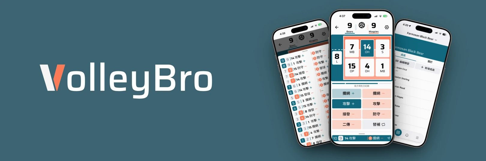
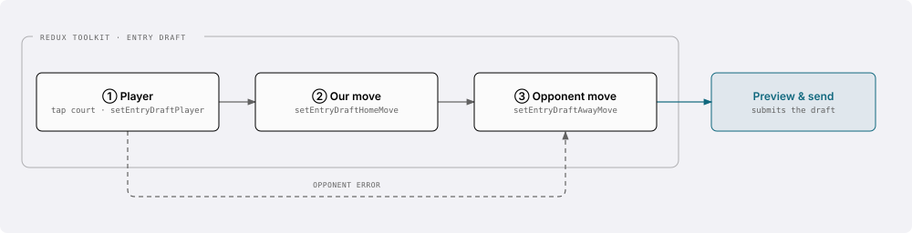
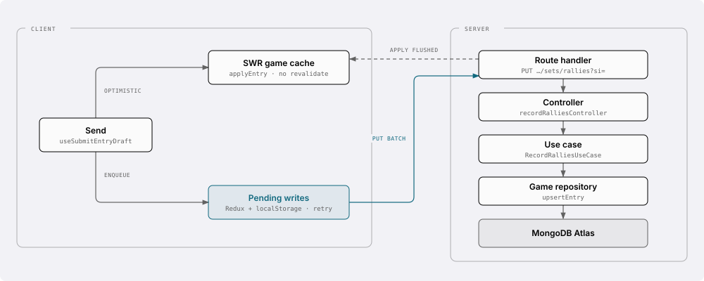
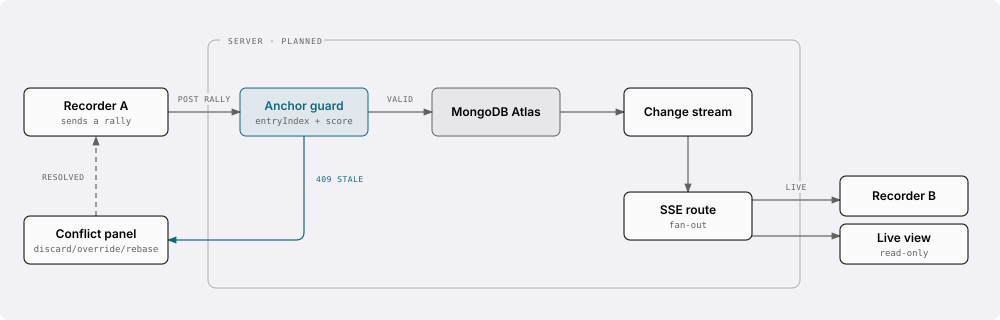
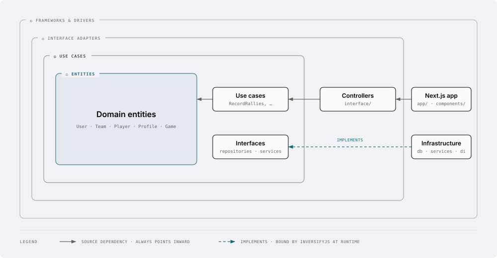

<a id="readme-top"></a>
<div align="center">

# VolleyBro

**為場邊而生的排球逐球記錄與球隊管理工具。**



[![Next.js][nextjs-badge]][nextjs-url] [![React][react-badge]][react-url] [![TypeScript][typescript-badge]][typescript-url] [![MongoDB][mongodb-badge]][mongodb-url] [![Tailwind CSS][tailwind-badge]][tailwind-url]

[![CI][ci-badge]][ci-url] [![Version][version-badge]][changelog-url]

[**線上版本**](https://volleybro.vercel.app/) · [**產品藍圖**][blueprint-url] · [**元件庫**](https://dev--67bbfeabbc72894ce5eb92db.chromatic.com) · [**回報問題**][issues-url] · [**討論區**][discussions-url]

📖 **[English version](./README.md)**

</div>

<details>
<summary><b>目錄</b></summary>

- [VolleyBro](#volleybro)
  - [關於專案](#關於專案)
  - [主要功能](#主要功能)
    - [🏐 比賽記錄](#-比賽記錄)
    - [📊 賽事分析](#-賽事分析)
    - [👥 隊伍管理](#-隊伍管理)
    - [📱 接近原生的 PWA 體驗](#-接近原生的-pwa-體驗)
  - [運作方式](#運作方式)
    - [記錄一球](#記錄一球)
    - [同步協作與 Live View（規劃中）](#同步協作與-live-view規劃中)
  - [專案架構](#專案架構)
  - [開始使用](#開始使用)
    - [前置需求](#前置需求)
    - [安裝步驟](#安裝步驟)
  - [開發指令](#開發指令)
  - [貢獻指南](#貢獻指南)
  - [授權條款](#授權條款)
  - [聯絡方式](#聯絡方式)

</details>

## 關於專案

用紙筆記錄比賽，意味著教練在寫字而不是在執教。VolleyBro 以點擊式介面取代紙本記錄表，設計目標是跟得上實際比賽節奏：一球三次點擊，數據隨記錄即時累積，而且就在口袋裡的手機上完成。

它是一個漸進式網頁應用程式（PWA）——可安裝、支援離線，在場邊用手機或賽後用筆電回顧同樣順手。

**技術組成：**

| 層級     | 技術                                                                  |
| -------- | --------------------------------------------------------------------- |
| 框架     | Next.js 16（App Router）· React 19 · TypeScript 6                     |
| UI       | Tailwind CSS 4 · Shadcn/UI（Radix）· Motion · Recharts                |
| 狀態管理 | Redux Toolkit（記錄介面）· SWR（伺服器狀態）· React Hook Form（表單） |
| 後端     | MongoDB Atlas · Mongoose · InversifyJS（依賴注入）                    |
| 認證     | Better Auth + Google OAuth                                            |
| PWA      | Serwist（`@serwist/turbopack`）                                       |
| 品質     | Jest · React Testing Library · Storybook · ESLint · Prettier          |

<p align="right">(<a href="#readme-top">回到頂端</a>)</p>

## 主要功能

### 🏐 比賽記錄

一球三次點擊——選擇做出動作的球員、記錄我方動作、記錄對方回應與結果。比分、輪轉與各項技術數據隨記錄即時更新；替補可在記錄流程中直接完成，不需離開畫面。

<div align="center">
  <picture>
    <source media="(prefers-color-scheme: dark)" srcset="public/landing/features/game-demo-1-dark.png">
    
  </picture>
  <picture>
    <source media="(prefers-color-scheme: dark)" srcset="public/landing/features/game-demo-2-dark.png">
    
  </picture>
</div>

### 📊 賽事分析

依技術項目拆解的球隊數據——發球、攔網、攻擊、接發、防守、舉球與非受迫失誤——搭配逐局比分，以及任一場過往比賽的完整逐球時間軸。

### 👥 隊伍管理

建立隊伍、透過使用者搜尋邀請成員，並管理權限角色（`OWNER` / `ADMIN` / `MEMBER`）。成員狀態遵循明確的邀請流程（`NONE` → `INVITED` → `JOINED`），陣容則於每場比賽個別設定。

<div align="center">
  <picture>
    <source media="(prefers-color-scheme: dark)" srcset="public/landing/features/team-demo-1-dark.png">
    
  </picture>
  <picture>
    <source media="(prefers-color-scheme: dark)" srcset="public/landing/features/team-demo-2-dark.png">
    
  </picture>
</div>

### 📱 接近原生的 PWA 體驗

可安裝並具備各平台專屬啟動畫面，分頁式導覽保有獨立捲動狀態，支援下拉更新，並透過平行路由實作覆蓋式 Modal。內建黑暗模式。

<p align="right">(<a href="#readme-top">回到頂端</a>)</p>

## 運作方式

### 記錄一球

單一球的記錄分為三個點擊步驟，過程中以 Redux 保存草稿；若為對方失誤則略過我方動作。最後由預覽的送出動作提交草稿。

<p align="center">
  
</p>

送出時不需等待網路。這一球會先以樂觀更新寫入 SWR 的比賽快取，並加入保存在 localStorage 的待送佇列；佇列會批次送往伺服器、對可重試的失敗以退避重試，並把伺服器回應套用回快取。

<p align="center">
  
</p>

一局與整場比賽是否結束屬於**推導結果，從不手動輸入**——每次寫入後，伺服器端會對僅供追加的記錄串列做一次 fold，判斷該局仍在進行中、來到局點，或已分出勝負（25 分且領先 2 分；決勝局為 15 分），並記錄結果。不需要手動結束任何一局。

### 同步協作與 Live View（規劃中）

同一場比賽常常有多人同時記錄，隊友也希望能即時跟上。目前的設計以 HTTP POST 負責寫入、Server-Sent Events 負責廣播，並透過**意圖錨點**確保並行記錄的安全性。

> [!NOTE]
> 本節描述的是已定案但**尚未實作**的設計，各功能目前狀態詳見[產品藍圖][blueprint-url]。

<p align="center">
  
</p>

錨點記錄的是使用者**開始輸入當下**所看到的狀態，而非按下送出當下。這個差別很關鍵：若非如此，當 SSE 更新在輸入過程中抵達，客戶端會誤以為自己正在寫入下一球，而伺服器其實已在該位置有記錄。錨點過期會回傳 `409` 並開啟阻擋式的衝突解決面板，而不是無聲地覆蓋隊友的記錄。

<p align="right">(<a href="#readme-top">回到頂端</a>)</p>

## 專案架構

VolleyBro 採用 Clean Architecture：同心分層，**原始碼依賴一律只向內**，內層對外層一無所知。

<p align="center">
  
</p>

跨越邊界向內時採用**依賴反轉**：Use Cases 層宣告 repository / service 的_介面_，由 infrastructure 層實作，並在執行期由 InversifyJS 注入具體實作 —— 因此領域層與 use cases 完全不沾 MongoDB、Next.js 或認證細節。

```txt
src/
├── entities/         # 領域層 — User、Team、Player、Profile、Game
├── applications/     # 應用層
│   ├── usecases/     #   商業使用案例（CreateGame、RecordRallies…）
│   ├── repositories/ #   資料存取抽象介面
│   └── services/     #   外部服務抽象介面
├── interface/        # 介面層 — 協調 use case 的 controller
├── infrastructure/   # 基礎設施層
│   ├── db/           #   Mongoose schema 與 repository 實作
│   ├── services/     #   認證與授權
│   └── di/           #   InversifyJS container
├── app/              # 表現層 — Next.js App Router（頁面、layout、API routes）
├── components/       # 表現層 — 依領域劃分的 React 元件
├── lib/              # 客戶端狀態、actions、helpers、hooks
└── hooks/            # 共用 React hooks
```

延伸閱讀：[`docs/architecture.md`](./docs/architecture.md) · [`docs/design-system.md`](./docs/design-system.md) · [`docs/testing-strategy.md`](./docs/testing-strategy.md)

<p align="right">(<a href="#readme-top">回到頂端</a>)</p>

## 開始使用

### 前置需求

- **Node.js** `24.x`
- **pnpm**（版本由 `packageManager` 欄位鎖定，執行 `corepack enable` 即可自動套用）
- **MongoDB** 連線字串與 **Google OAuth** 憑證

### 安裝步驟

1. Clone 專案

   ```bash
   git clone https://github.com/AndrewCK24/volleybro.git
   cd volleybro
   ```

2. 安裝相依套件

   ```bash
   pnpm install
   ```

3. 複製 `.env.example` 為 `.env.local`，再依檔案內的註解填入各變數

   ```bash
   cp .env.example .env.local
   ```

4. 啟動開發伺服器

   ```bash
   pnpm dev
   ```

   開啟 [http://localhost:3000](http://localhost:3000)。

<p align="right">(<a href="#readme-top">回到頂端</a>)</p>

## 開發指令

```bash
pnpm dev          # 開發伺服器
pnpm build        # 生產版本建置
pnpm test         # 測試套件
pnpm test:watch   # 監看模式執行測試
pnpm storybook    # 元件工作台，:6006
pnpm verify       # format:check + typecheck + lint + test
pnpm verify:all   # verify + 應用建置 + service worker 檢查 + blueprint 建置
```

commit 前請先通過 `pnpm verify`；開 PR 前請先通過 `pnpm verify:all`。

<p align="right">(<a href="#readme-top">回到頂端</a>)</p>

## 貢獻指南

請參閱 [CONTRIBUTING.md](./CONTRIBUTING.md) 了解分支規範、commit 規範、程式碼風格與測試要求。

<p align="right">(<a href="#readme-top">回到頂端</a>)</p>

## 授權條款

All rights reserved. 完整條款請見 [LICENSE](./LICENSE)。

<p align="right">(<a href="#readme-top">回到頂端</a>)</p>

## 聯絡方式

- 💬 **[討論區][discussions-url]** — 一般討論、想法分享或尋求協助
- 🐛 **[Issues][issues-url]** — 問題回報與功能建議
- 🛡️ **[安全性通報](https://github.com/AndrewCK24/volleybro/security/advisories/new)** — 請私下回報安全漏洞，勿建立公開 issue

<p align="right">(<a href="#readme-top">回到頂端</a>)</p>

<!-- Badge definitions -->

[nextjs-badge]: https://img.shields.io/badge/Next.js-16-000000?style=for-the-badge&logo=nextdotjs&logoColor=white
[nextjs-url]: https://nextjs.org/
[react-badge]: https://img.shields.io/badge/React-19-61DAFB?style=for-the-badge&logo=react&logoColor=black
[react-url]: https://react.dev/
[typescript-badge]: https://img.shields.io/badge/TypeScript-6-3178C6?style=for-the-badge&logo=typescript&logoColor=white
[typescript-url]: https://www.typescriptlang.org/
[mongodb-badge]: https://img.shields.io/badge/MongoDB-Atlas-47A248?style=for-the-badge&logo=mongodb&logoColor=white
[mongodb-url]: https://www.mongodb.com/
[tailwind-badge]: https://img.shields.io/badge/Tailwind-4-06B6D4?style=for-the-badge&logo=tailwindcss&logoColor=white
[tailwind-url]: https://tailwindcss.com/
[ci-badge]: https://img.shields.io/github/actions/workflow/status/AndrewCK24/volleybro/ci.yml?branch=main&style=flat-square&label=CI
[ci-url]: https://github.com/AndrewCK24/volleybro/actions/workflows/ci.yml
[version-badge]: https://img.shields.io/github/package-json/v/AndrewCK24/volleybro/main?style=flat-square
[changelog-url]: ./CHANGELOG.md
[issues-url]: https://github.com/AndrewCK24/volleybro/issues
[discussions-url]: https://github.com/AndrewCK24/volleybro/discussions
[blueprint-url]: https://volleybro-blueprint.andrewck24.workers.dev
