# 02.01 使用者管理 (User Management)

## 1. 概述

本文件詳細描述 VolleyBro 系統的使用者管理功能需求，涵蓋註冊、登入、個人資料管理、帳號安全、個人化設置以及球隊關係管理。這些功能旨在為未註冊用戶和已註冊用戶提供安全、便捷的使用體驗，同時滿足與球隊相關的操作需求。

---

## 2. 功能需求列表

### 註冊系統 (1.0.0)

#### FR-1.0.0.0 電子郵件註冊

**功能 ID**: FR-1.0.0.0
**標題**: 電子郵件註冊
**描述**: 未註冊用戶可透過電子郵件註冊新帳號。
**詳細說明**:

- 註冊表單要求輸入電子郵件、密碼和確認密碼。
- 系統驗證電子郵件格式是否正確，並檢查密碼強度（至少 8 位，包含大小寫字母、數字和特殊字符）。
- 註冊成功後，系統發送驗證郵件至使用者提供的電子郵件地址。
- 使用者點擊驗證連結後，帳號正式啟用。

**流程圖**:

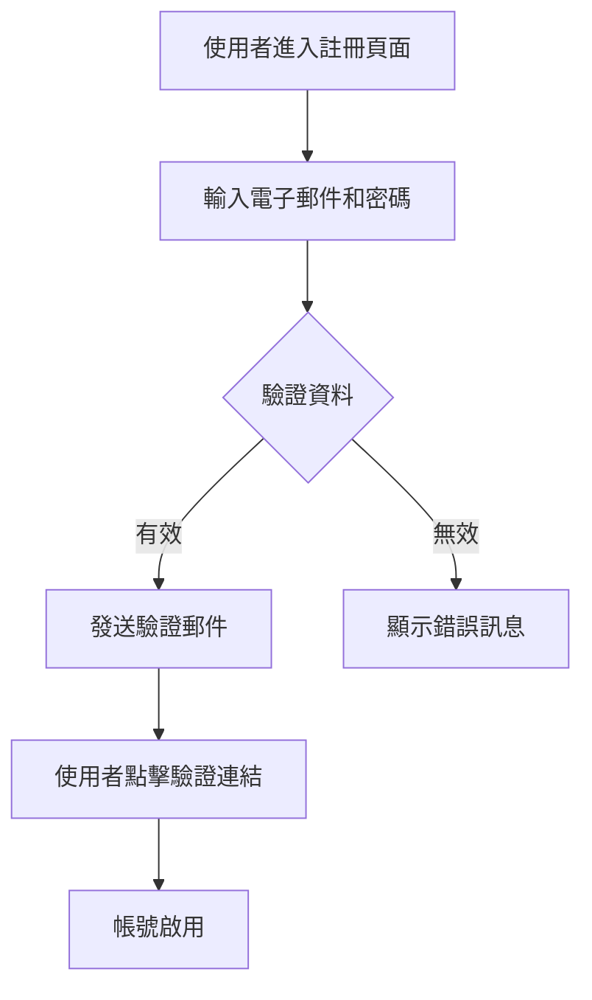

**驗收標準**:

- 註冊表單能正確驗證輸入資料並發送驗證郵件。
- 使用者完成驗證後可成功登入。

**測試案例**:

```gherkin
Feature: 電子郵件註冊
  Scenario: 使用有效資料註冊新帳號
    Given 使用者進入註冊頁面
    When 使用者輸入有效的電子郵件 "user@example.com" 和密碼 "P@ssw0rd"
    And 使用者提交註冊表單
    Then 系統發送驗證郵件
    And 使用者點擊驗證連結後帳號啟用
```

#### FR-1.0.0.1 Google 帳號註冊

**功能 ID**: FR-1.0.0.1
**標題**: Google 帳號註冊  
**描述**: 未註冊用戶可使用 Google 帳號快速註冊。  
**詳細說明**:

- 使用者點擊「使用 Google 註冊」按鈕，系統啟動 OAuth 授權流程。
- 系統自動獲取 Google 帳號的姓名、電子郵件和大頭貼照，並填入註冊資料。
- 註冊成功後，系統創建新帳號並導向主頁面。

**流程圖**:

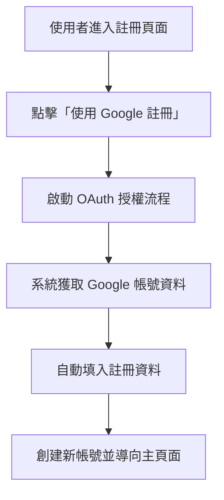

**驗收標準**:

- Google 註冊流程順利完成，且資料自動填入。
- 使用者註冊後可立即使用系統功能。

**測試案例**:

```gherkin
Feature: Google 帳號註冊
  Scenario: 使用 Google 帳號註冊
    Given 使用者進入註冊頁面
    When 使用者點擊「使用 Google 註冊」
    And 系統完成 OAuth 授權流程
    Then 系統自動填入 Google 帳號資料
    And 使用者註冊成功並導向主頁面
```

**Version Changes**:

- **v0.2.2**: 首次加入 `Google 帳號註冊` 功能。

---

### 登入系統 (1.0.1)

#### FR-1.0.1.0 電子郵件登入

**功能 ID**: FR-1.0.1.0
**標題**: 電子郵件登入  
**描述**: 已註冊用戶可使用電子郵件和密碼登入系統。  
**詳細說明**:

- 登入表單要求輸入電子郵件和密碼。
- 系統驗證憑證，若正確則發放 JWT token 並導向主頁面。
- 提供「忘記密碼」連結，允許使用者透過電子郵件重設密碼。

**流程圖**:

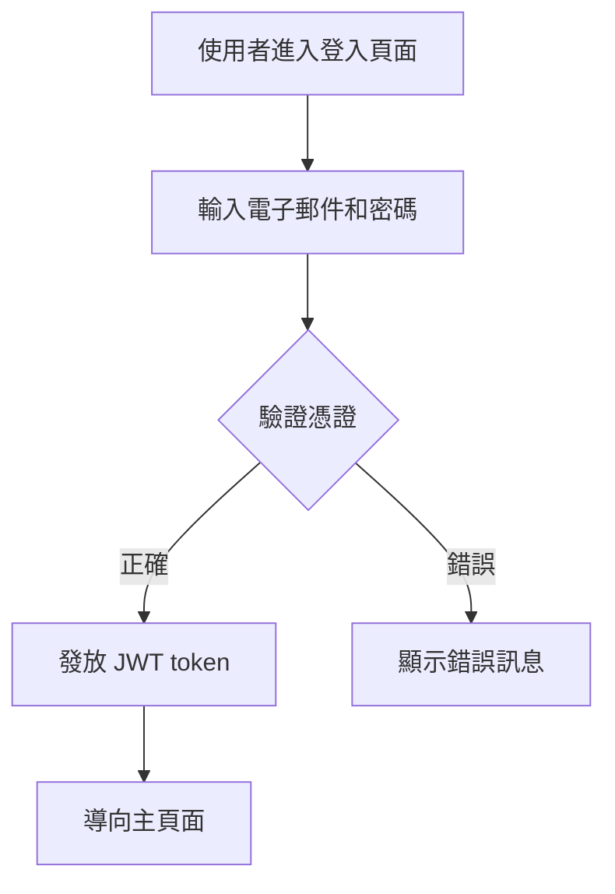

**驗收標準**:

- 登入成功後導向主頁面。
- 「忘記密碼」選項可正常運作並發送重設郵件。

**測試案例**:

```gherkin
Feature: 電子郵件登入
  Scenario: 使用正確憑證登入
    Given 使用者進入登入頁面
    When 使用者輸入電子郵件 "user@example.com" 和密碼 "P@ssw0rd"
    And 使用者提交登入表單
    Then 系統發放 JWT token
    And 使用者被導向主頁面
```

#### FR-1.0.1.1 Google 帳號登入

**功能 ID**: FR-1.0.1.1  
**標題**: Google 帳號登入  
**描述**: 已註冊用戶可使用 Google 帳號快速登入。  
**詳細說明**:

- 使用者點擊「使用 Google 登入」按鈕，系統透過 OAuth 授權流程驗證身份。
- 登入成功後，系統發放 JWT token 並導向主頁面。

**流程圖**:

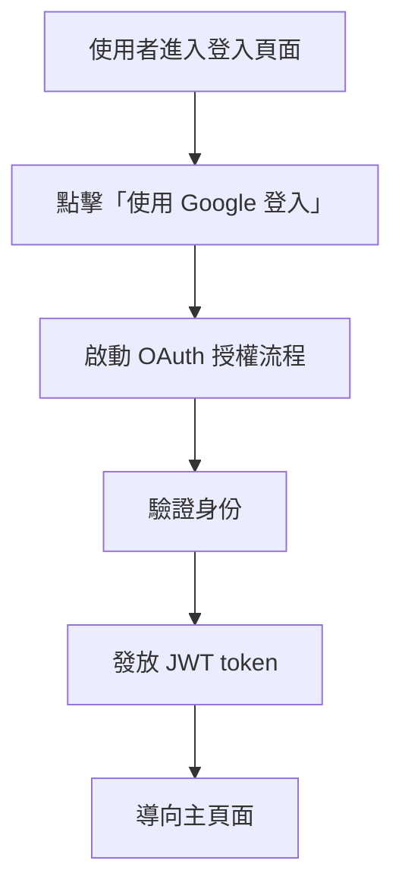

**驗收標準**:

- Google 登入流程順利完成並導向主頁面。
- JWT token 正確發放。

**測試案例**:

```gherkin
Feature: Google 帳號登入
  Scenario: 使用 Google 帳號登入
    Given 使用者進入登入頁面
    When 使用者點擊「使用 Google 登入」
    And 系統完成 OAuth 授權流程
    Then 系統發放 JWT token
    And 使用者被導向主頁面
```

**Version Changes**:

- **v0.2.2**: 首次加入 `Google 帳號登入` 功能。

---

### 登出系統 (1.0.2)

#### FR-1.0.2.0 登出

**功能 ID**: FR-1.0.2.0
**標題**: 登出
**描述**: 已登入用戶可安全登出系統。
**詳細說明**:

- 使用者點擊「登出」按鈕，系統清除 JWT token 並導向登入頁面。
- 登出後，使用者無法再訪問需要登入的頁面。
- 系統需提供登出成功的提示訊息。
  **流程圖**:

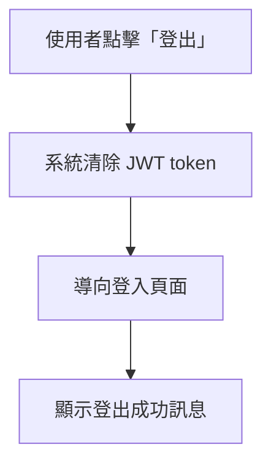

**驗收標準**:

- 登出後使用者無法訪問需要登入的頁面。
- 系統顯示登出成功的提示訊息。

**測試案例**:

```gherkin
Feature: 登出
  Scenario: 使用者登出
    Given 使用者已登入
    When 使用者點擊「登出」按鈕
    Then 系統清除 JWT token
    And 使用者被導向登入頁面
    And 系統顯示登出成功的提示訊息
```

**Version Changes**:

- **v0.2.2**: 首次加入 `登出` 功能。

---

### 更新個人資料 (1.1.0)

#### FR-1.1.0.0 查看個人資料

**功能 ID**: FR-1.1.0.0
**標題**: 查看個人資料
**描述**: 已登入用戶可查看自己的個人資料。
**詳細說明**:

- 個人資料頁面顯示姓名、電子郵件、大頭貼照和偏好設置等資訊。
- 資料預設以只讀模式顯示，提供「編輯」按鈕以進入編輯模式。

**驗收標準**:

- 顯示的資料需與資料庫一致。
- 編輯按鈕可正常切換至編輯模式。

**測試案例**:

```gherkin
Feature: 查看個人資料
  Scenario: 查看個人資料
    Given 使用者已登入
    When 使用者進入個人資料頁面
    Then 系統顯示使用者的姓名、電子郵件、大頭貼照和偏好設置
```

#### FR-1.1.0.1 編輯個人資料

**功能 ID**: FR-1.1.0.1
**標題**: 編輯個人資料
**描述**: 已登入用戶可編輯個人資料。
**詳細說明**:

- 編輯模式下，使用者可修改姓名和偏好設置。
- 提交修改後，系統更新資料庫並顯示成功訊息。
- 若修改電子郵件，需重新發送驗證郵件並完成驗證。

**流程圖**:

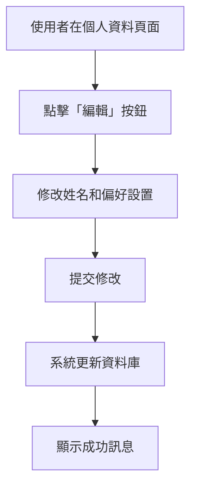

**驗收標準**:

- 修改後資料正確更新並顯示成功訊息。
- 電子郵件變更需重新驗證。

**測試案例**:

```gherkin
Feature: 編輯個人資料
  Scenario: 修改個人資料
    Given 使用者已登入並在個人資料頁面
    When 使用者點擊「編輯」按鈕
    And 使用者修改姓名和偏好設置
    And 使用者提交修改
    Then 系統更新資料庫並顯示成功訊息
```

**Version Changes**:

- **尚未完成**

---

### 隱私設定 (1.1.1)

#### FR-1.1.1.0 更改密碼

**功能 ID**: FR-1.1.1.0  
**標題**: 更改密碼  
**描述**: 已登入用戶可更改登入密碼以保護帳號安全。
**詳細說明**:

- 密碼更改表單要求輸入舊密碼、新密碼和確認新密碼。
- 系統驗證舊密碼正確性，並檢查新密碼是否符合強度要求。
- 更改成功後，系統更新密碼並發送通知郵件至使用者電子郵件。

**流程圖**:

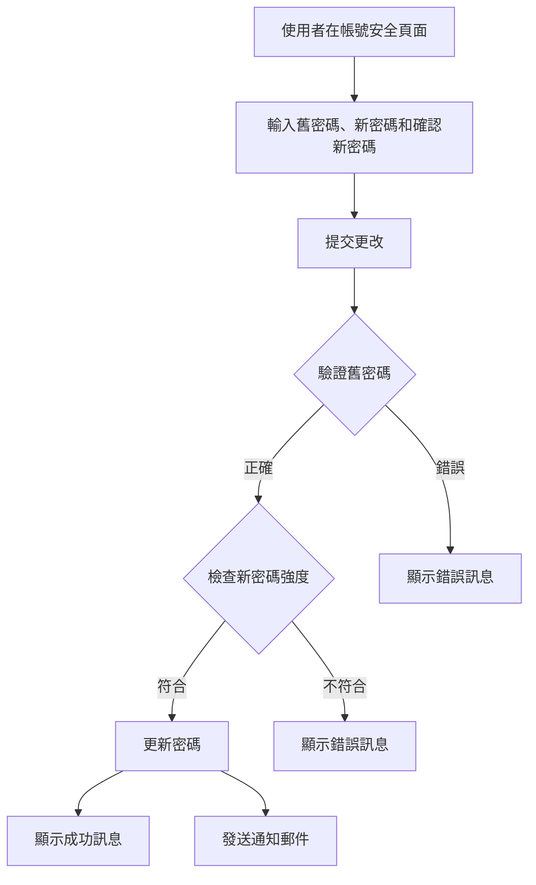

**驗收標準**:

- 密碼更改流程要求舊密碼並驗證新密碼強度。
- 更改成功後收到通知郵件。

**測試案例**:

```gherkin
Feature: 更改密碼
  Scenario: 使用者更改密碼
    Given 使用者已登入並在帳號安全頁面
    When 使用者輸入舊密碼 "OldP@ssw0rd" 和新密碼 "NewP@ssw0rd"
    And 使用者提交更改
    Then 系統驗證舊密碼正確性
    And 系統檢查新密碼強度
    And 系統更新密碼並顯示成功訊息、發送通知郵件
```

**Version Changes**:

- **尚未完成**

### 個人化帳號 (1.1.2)

#### FR-1.1.2.0 上傳大頭貼照

**功能 ID**: FR-1.1.2.0  
**標題**: 上傳大頭貼照
**描述**: 已登入用戶可上傳或更改個人照片。
**詳細說明**:

- 大頭貼照上傳功能支援圖片裁剪和即時預覽。
- 系統支援常見格式（JPG、PNG）。
- 系統自動調整圖片大小以符合要求（例如 200x200 像素）。
- 上傳成功後，大頭貼照即時更新於個人資料頁面。

**流程圖**:

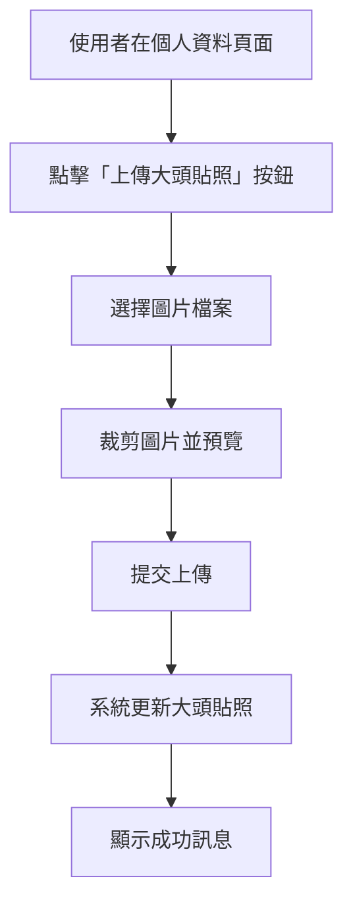

**驗收標準**:

- 大頭貼照上傳功能支援裁剪並即時預覽。
- 上傳後大頭貼照正確顯示於個人資料頁面。

**測試案例**:

```gherkin
Feature: 上傳大頭貼照
  Scenario: 使用者上傳大頭貼照
    Given 使用者已登入並在個人資料頁面
    When 使用者點擊「上傳大頭貼照」按鈕
    And 使用者選擇圖片檔案 "profile.jpg"
    And 使用者裁剪圖片並預覽
    And 使用者提交上傳
    Then 系統更新大頭貼照並顯示成功訊息
```

**Version Changes**:

- **尚未完成**

---

### 2.6 查看球隊列表 (1.2.0)

#### FR-1.2.0.0 查看已加入球隊

**功能 ID**: FR-1.2.0.0
**標題**: 查看已加入球隊
**描述**: 已登入用戶可查看自己已加入的球隊列表。
**詳細說明**:

- 列表顯示球隊名稱、角色（例如 OWNER、ADMIN、MEMBER）。
- 每個球隊項目提供快速連結以訪問對應球隊頁面。

**驗收標準**:

- 列表正確顯示已加入球隊的資訊。
- 點擊球隊名稱可正確導向對應球隊頁面。

**測試案例**:

```gherkin
Feature: 查看已加入球隊
  Scenario: 使用者查看已加入球隊列表
    Given 使用者已登入
    When 使用者進入球隊列表頁面
    Then 系統顯示使用者已加入的球隊名稱、角色
    And 點擊球隊名稱可正確導向對應球隊頁面
```

#### FR-1.2.0.1 查看受邀球隊

**功能 ID**: FR-1.2.0.1  
**標題**: 查看受邀球隊  
**描述**: 已登入用戶可查看收到的球隊邀請。  
**詳細說明**:

- 列表顯示邀請球隊的名稱、邀請人和邀請日期。
- 每個邀請項目提供「接受」和「拒絕」按鈕。

**驗收標準**:

- 列表正確顯示受邀球隊的狀態和操作選項。
- 點擊「接受」或「拒絕」後，系統正確處理邀請並更新列表。

**測試案例**:

```gherkin
Feature: 查看受邀球隊
  Scenario: 使用者查看受邀球隊列表
    Given 使用者已登入
    When 使用者進入受邀球隊頁面
    Then 系統顯示使用者收到的球隊邀請名稱、邀請人和日期
    And 點擊「接受」或「拒絕」後系統正確處理邀請並更新列表
```

**Version Changes**:

- **v0.2.3**: 首次加入 `查看球隊列表` 功能。

---

### 2.7 處理球隊邀請 (1.2.1)

#### FR-1.2.1.1 接受球隊邀請

**功能 ID**: FR-1.2.1.0
**標題**: 接受球隊邀請
**描述**: 已登入用戶可接受球隊邀請並加入球隊。  
**詳細說明**:

- 使用者點擊「接受」後，系統連結使用者資訊 (USER) 至對應的球隊成員資料。
- 邀請從列表中移除，並發送通知給邀請人。

**流程圖**:

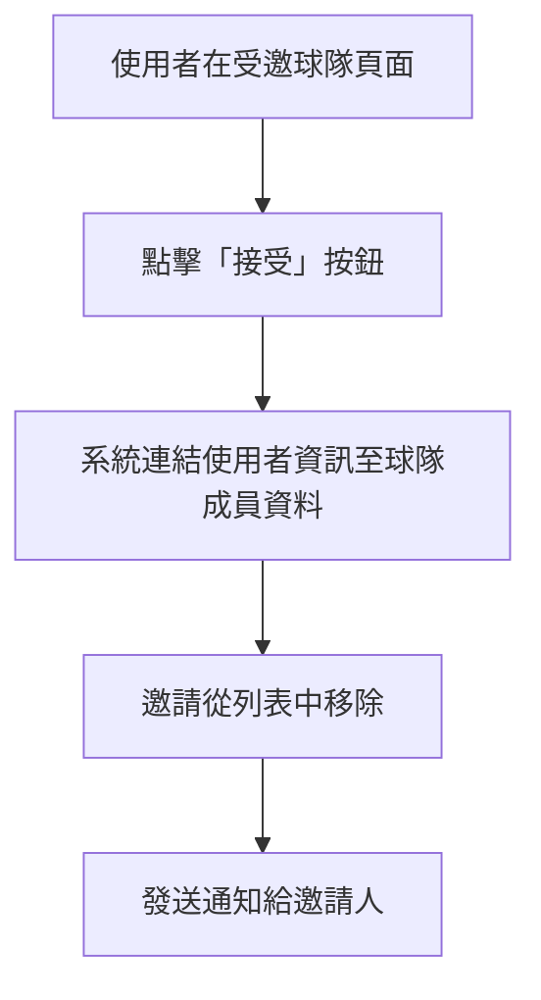

**驗收標準**:

- 接受後成功加入球隊，列表更新。
- 通知正確發送給邀請人。
- 使用者可在球隊列表中看到新加入的球隊。

**測試案例**:

```gherkin
Feature: 接受球隊邀請
  Scenario: 使用者接受球隊邀請
    Given 使用者已登入並在受邀球隊頁面
    When 使用者點擊「接受」按鈕
    Then 系統連結使用者資訊至球隊成員資料
    And 邀請從列表中移除
    And 系統發送通知給邀請人
```

#### FR-1.2.1.1 拒絕球隊邀請

**功能 ID**: FR-1.2.1.1
**標題**: 拒絕球隊邀請  
**描述**: 已登入用戶可拒絕球隊邀請。  
**詳細說明**:

- 使用者點擊「拒絕」後，邀請從列表中移除。
- 系統發送通知給邀請人，告知邀請被拒絕。

**流程圖**:

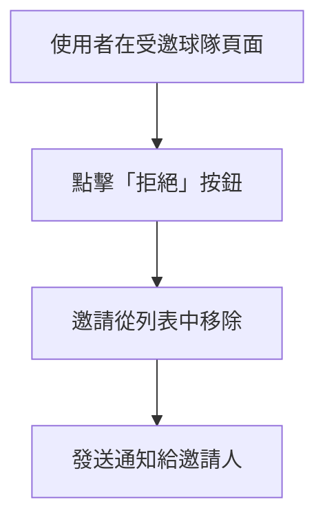

**驗收標準**:

- 拒絕後邀請移除，通知正確發送。

**測試案例**:

```gherkin
Feature: 拒絕球隊邀請
  Scenario: 使用者拒絕球隊邀請
    Given 使用者已登入並在受邀球隊頁面
    When 使用者點擊「拒絕」按鈕
    Then 邀請從列表中移除
    And 系統發送通知給邀請人
```

**Version Changes**:

- **v0.2.3**: 首次加入 `處理球隊邀請` 功能。

---

### 2.8 切換所屬球隊 (1.2.2)

#### FR-1.2.2.0 切換預設登入球隊

**功能 ID**: FR-1.2.2.0
**標題**: 切換預設登入球隊
**描述**: 已登入用戶可在已加入的球隊間切換。
**詳細說明**:

- 切換選單顯示所有已加入的球隊名稱和角色，顯示預設登入球隊。
- 使用者選擇球隊後，系統更新預設登入球隊，顯示該球隊的資訊頁面。
- 系統記錄最近訪問的球隊，方便快速切換。

**流程圖**:

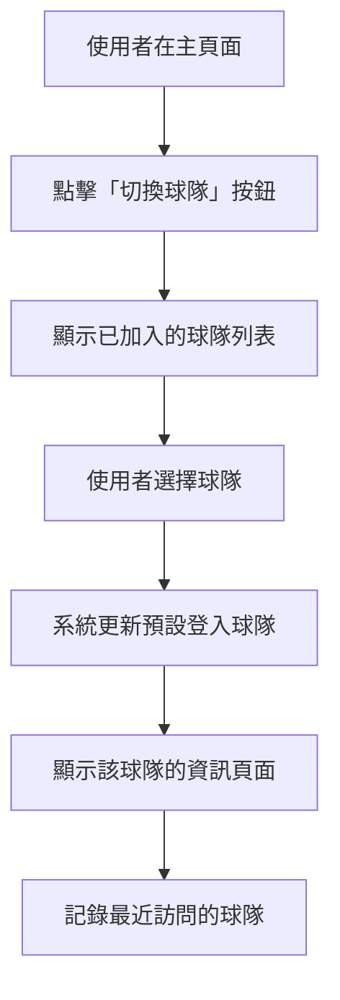

**驗收標準**:

- 切換後正確顯示對應球隊的資訊和功能。
- 預設登入球隊更新成功，並在下次登入時自動顯示。
- 最近訪問的球隊列表正確更新。

**測試案例**:

```gherkin
Feature: 切換當前球隊
  Scenario: 使用者切換所屬球隊
    Given 使用者已登入並在主頁面
    When 使用者點擊「切換球隊」按鈕
    And 使用者選擇球隊 "Team A"
    Then 系統更新預設登入球隊為 "Team A"
    And 顯示該球隊的資訊頁面
    And 最近訪問的球隊列表正確更新
```

**Version Changes**:

- **v0.2.3**:: 首次加入 `切換預設球隊` 功能。

---

## 3. 資料模型關聯

使用者管理模組涉及以下資料模型：

- **User**: 儲存使用者基本資訊（姓名、電子郵件、大頭貼照、偏好設置）和球隊關係（預設登入球隊、已加入球隊、受邀球隊）
- **Account**: 儲存外部認證資訊（如 Google OAuth 資料）
- **Session**: 管理使用者的登入會話和 JWT token

## 4. 技術需求

### 4.1 驗證與授權 (Authentication & Authorization)

- 使用 [Auth.js](https://authjs.dev/) 實現電子郵件和 Google 帳號的身份驗證
- 實施 JWT（JSON Web Token）進行身份驗證和會話管理
- 實施基於角色的權限控制系統，確保用戶只能訪問被授權的功能

### 4.2 安全性 (Security)

- 所有密碼使用 bcrypt 加密算法儲存
- 實施防 CSRF 和 XSS 攻擊措施
- 確保所有敏感操作需要二次驗證

### 4.3 隱私與合規 (Privacy & Compliance)

- 用戶資料處理必須符合 GDPR 等隱私法規要求
- 個人敏感資料必須加密儲存
- 實施資料備份與恢復機制

### 4.4 效能與擴展性 (Performance & Scalability)

- 用戶資料請求響應時間不超過 500ms
- 個人資料載入時間不超過 500ms
- 登入流程完成時間不超過 2 秒
- 系統須支援同時處理至少 1000 名用戶的註冊/登入請求
- 用戶上傳的大頭貼照必須進行壓縮和優化處理
