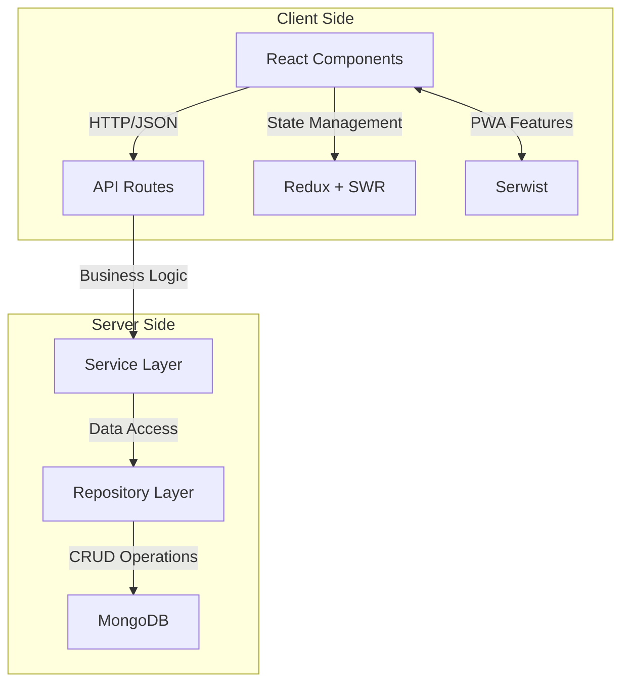

# 04. 技術架構 (Technical Architecture)

## 0. 概述

本文件詳細描述 VolleyBro 系統的技術架構，涵蓋前端、後端、資料庫和認證服務等核心組件。VolleyBro 是一個基於 Web 的排球隊伍管理和賽事紀錄平台，其技術架構採用現代化的 Web 技術棧，並結合 Clean Architecture 設計原則，確保系統具備模組化、可維護性和可擴展性。技術架構的設計旨在滿足功能需求與非功能性需求，特別是在效能、安全性和可用性方面，為用戶提供高效且穩定的使用體驗。

---

## 1. 技術棧

### 1.0 前端

- **框架**: Next.js (基於 React)

  - 支援伺服器端渲染（SSR）和靜態網站生成（SSG），提升頁面載入速度並優化 SEO。
  - 提供內建路由和 API 路由功能，簡化前端與後端的整合開發。

- **狀態管理**: Redux + SWR

  - Redux 用於管理應用程式全局狀態，確保資料一致性和可預測性。
  - SWR 用於資料獲取與快取，提升 API 通訊效率並實現即時資料更新。

- **UI 組件**: Shadcn UI + Tailwind CSS

  - Shadcn UI 提供可重用的 UI 組件，確保介面設計的一致性與美觀性。
  - Tailwind CSS 提供靈活的樣式工具，加速 UI 開發並支援客製化設計。

- **API 通訊**: Fetch API

  - 採用原生的 Fetch API 進行 HTTP 請求，輕量高效且易於維護。

- **PWA 功能**: Serwist

  - 使用 Serwist 構建漸進式網頁應用（PWA），提供類原生應用的使用體驗。
  - 支援應用安裝到主屏幕、推送通知，並計劃未來實現離線功能支援。
  - 優化載入速度和回訪使用者體驗，提升應用可用性。

### 1.1 後端

- **框架**: Next.js API Routes

  - 利用 Next.js 的 API 路由功能實現後端邏輯，與前端實現無縫整合。

- **依賴注入**: Inversify.js

  - 使用 Inversify.js 管理依賴注入，增強模組間的解耦並提升可測試性。

- **資料庫**: MongoDB

  - 採用 MongoDB 作為 NoSQL 資料庫，提供靈活的資料結構和高性能查詢能力。

- **認證服務**: Auth.js

  - 使用 Auth.js 實現安全的身份驗證機制，支援電子郵件和 Google 帳號登入。

---

## 2. 後端 Clean Architecture

後端採用 Clean Architecture 設計原則，將系統分為以下層級，確保職責分離與模組化：

- **API Routes**:

  - 作為系統的入口點，負責處理前端發送的 HTTP 請求並返回響應。

- **Service Layer**:

  - 包含核心業務邏輯，處理具體的業務需求，例如賽事紀錄、球隊管理等功能。

- **Repository Layer**:

  - 負責資料存取，與資料庫互動並抽象化資料操作，提供一致的資料介面。

- **Database (MongoDB)**:

  - 儲存系統的核心資料，包括用戶資訊、球隊資料和賽事紀錄等。

這種分層設計確保業務邏輯與資料存取分離，提升系統的可維護性、可測試性和可擴展性。

---

## 3. 架構圖

以下 Mermaid 圖表展示 VolleyBro 系統的技術架構，涵蓋前端與後端組件的互動關係：

**圖表說明**：

- **Client Side**:

  - **React Components**: 使用 Next.js 構建的用戶介面，透過 Fetch API 與後端 API Routes 通訊。
  - **Redux + SWR**: 管理應用狀態與資料獲取，確保資料一致性與即時更新。
  - **Serwist**: 提供 PWA 功能，包括離線訪問、推送通知和應用安裝等增強型網頁體驗。

- **Server Side**:

  - **API Routes**: 接收前端請求並調用 Service Layer 處理業務邏輯。
  - **Service Layer**: 實現業務邏輯並與 Repository Layer 互動存取資料。
  - **Repository Layer**: 封裝資料庫操作，與 MongoDB 進行 CRUD 操作。
  - **MongoDB**: 儲存系統資料，提供高效的查詢與資料管理。

---

## 4. 技術需求

### 4.0 部署與擴展

- 系統部署於 Vercel 平台，支援自動部署與全球 CDN 加速。
- 未來計畫採用容器化技術（Docker），以實現多環境部署與水平擴展。

### 4.1 API 設計

- 所有 API 遵循 RESTful 原則，並提供 OpenAPI 規格文件。
- API 響應時間需控制在 500 毫秒以內。

### 4.2 安全性

- **身份驗證**: 使用 Auth.js 實現，支援電子郵件與 Google 帳號登入，密碼採用 bcrypt 加密（salt rounds 至少為 12）。
- **資料加密**: 敏感資料在資料庫中加密儲存，傳輸過程使用 HTTPS（TLS 1.2 或以上）。
