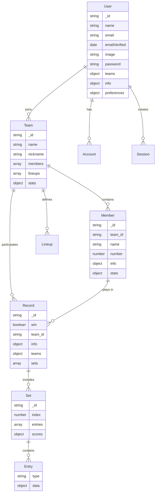
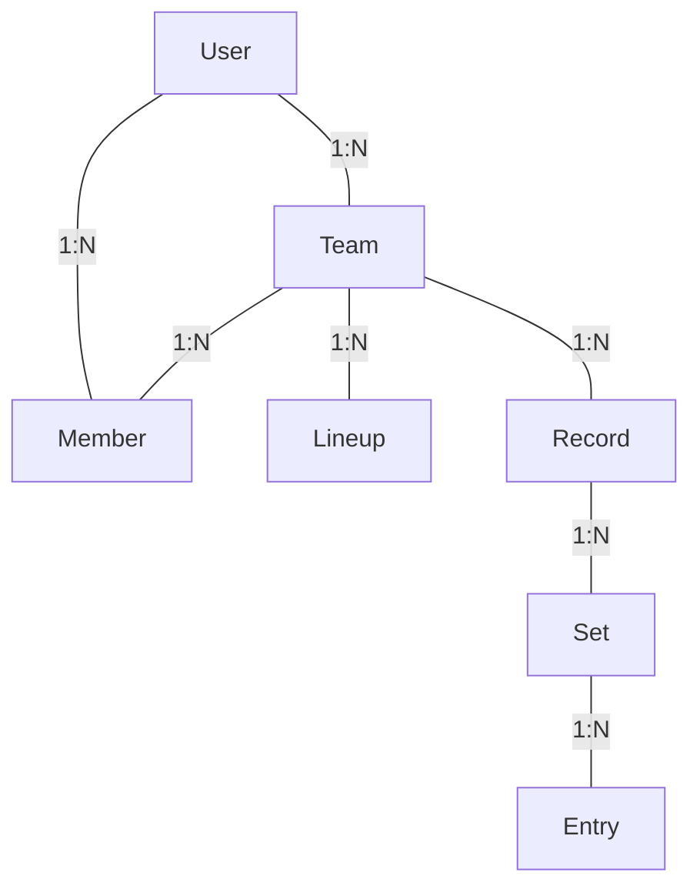

# 05. 數據模型 (Data Model)

## 0. 概述

本文檔描述 VolleyBro 應用程式中使用的主要數據模型及其關係。

---

## 1. 領域實體 (Domain Entities)

### 用戶 (User)

用戶實體代表系統中的註冊用戶。

```typescript
interface User {
  _id: string;
  name: string;
  email: string;
  emailVerified?: Date;
  image?: string;
  password?: string;
  teams: {
    joined: string[]; // 已加入的隊伍 ID
    inviting: string[]; // 收到邀請的隊伍 ID
  };
  info?: object; // 用戶附加信息
  preferences?: object; // 用戶偏好設置
}
```

### 隊伍 (Team)

隊伍實體代表一個排球隊。

```typescript
enum Role {
  MEMBER, // 一般隊員
  OWNER, // 隊伍擁有者
  ADMIN, // 隊伍管理員
}

enum Position {
  NONE = "", // 未指定位置
  OH = "OH", // 主攻手
  MB = "MB", // 中間攔網手
  OP = "OP", // 副攻手
  S = "S", // 舉球員
  L = "L", // 自由球員
}

interface Team {
  _id: string;
  name: string; // 隊伍名稱
  nickname?: string; // 隊伍暱稱
  members: {
    // 隊員列表
    _id: string;
    email?: string;
    role: Role;
    user_id: string;
  }[];
  lineups: Lineup[]; // 陣容列表
  stats?: TeamStats[]; // 隊伍統計數據
  createdAt?: Date;
  updatedAt?: Date;
}
```

### 陣容 (Lineup)

陣容定義了一個隊伍的上場人員安排。

```typescript
interface Lineup {
  options: {
    liberoReplaceMode: 0 | 1 | 2;
    liberoReplacePosition: Position;
  };
  starting: {
    // 先發陣容
    _id: string;
    position: Position;
    sub?: {
      // 替補紀錄
      _id: string;
      entryIndex: { in?: number; out?: number };
    };
  }[];
  liberos: {
    // 自由球員
    _id: string;
    position: Position;
    sub?: {
      // 替補紀錄
      _id: string;
      entryIndex: { in?: number; out?: number };
    };
  }[];
  substitutes: {
    // 替補球員
    _id: string;
    sub?: {
      // 上場紀錄
      _id: string;
      entryIndex: { in?: number; out?: number };
    };
  }[];
}
```

### 隊員 (Member)

隊員實體代表一個隊伍中的成員。

```typescript
interface Member {
  _id: string;
  team_id: string; // 所屬隊伍 ID
  name: string; // 隊員姓名
  number: number; // 球員號碼
  info?: object; // 隊員附加信息
  stats?: object; // 隊員統計數據
}
```

### 比賽紀錄 (Record)

比賽紀錄實體包含一場比賽的完整信息。

```typescript
enum MatchPhase {
  NONE,
  ELIM, // 淘汰賽
  SEED, // 種子賽
  QUAL, // 資格賽
  FINAL, // 決賽
}

enum MatchDivision {
  NONE,
  MEN, // 男子組
  WOMEN, // 女子組
  MIXED, // 混合組
}

enum MatchCategory {
  NONE,
  SENIOR, // 成人組
  JUNIOR, // 青年組
  YOUTH, // 少年組
}

enum MoveType {
  SERVING = 1, // 發球
  BLOCKING, // 攔網
  ATTACK, // 攻擊
  RECEPTION, // 接發球
  DEFENSE, // 防守
  SETTING, // 舉球
  UNFORCED, // 非強迫性失誤
}

enum EntryType {
  RALLY, // 得分回合
  SUBSTITUTION, // 換人
  TIMEOUT, // 暫停
  CHALLENGE, // 挑戰
}

interface Record {
  _id: string;
  win: boolean; // 是否獲勝
  team_id: string; // 記錄方隊伍 ID
  info: Match; // 比賽基本信息
  teams: {
    home: Team; // 主隊
    away: Team; // 客隊
  };
  sets: Set[]; // 各局數據
  createdAt?: Date;
  updatedAt?: Date;
}
```

### 其他相關實體

- **賽事 (Match)**: 比賽基本信息
- **球員統計 (PlayerStats)**: 球員表現數據
- **隊伍統計 (TeamStats)**: 隊伍整體表現數據
- **賽局 (Set)**: 一場比賽中的每一局
- **回合 (Rally)**: 一個得分回合
- **換人 (Substitution)**: 換人記錄
- **暫停 (Timeout)**: 暫停記錄
- **挑戰 (Challenge)**: 挑戰記錄

---

## 2. 數據庫模型 (Database Schemas)

系統使用 Mongoose 與 MongoDB 實現數據持久化。以下是主要的數據庫模型：

### User Schema

```typescript
const userSchema = new Schema<UserDocument>(
  {
    name: { type: String, required: true, trim: true },
    email: { type: String, required: true, trim: true },
    emailVerified: { type: Date, required: false, trim: true },
    image: { type: String, required: false, trim: true },
    password: { type: String, required: false },
    teams: {
      joined: [{ type: Schema.Types.ObjectId, ref: "Team", required: false }],
      inviting: [{ type: Schema.Types.ObjectId, ref: "Team", required: false }],
    },
    info: { type: Object, required: false },
    preferences: { type: Object, required: false },
  },
  { timestamps: true }
);
```

### Team Schema

```typescript
const teamSchema = new Schema<TeamDocument>(
  {
    name: { type: String, required: true },
    nickname: { type: String },
    members: [
      {
        _id: { type: Schema.Types.ObjectId, ref: "Member" },
        email: { type: String },
        role: { type: String, enum: [Role.MEMBER, Role.OWNER, Role.ADMIN] },
        user_id: { type: Schema.Types.ObjectId, ref: "User" },
      },
    ],
    lineups: [lineupSchema],
    stats: { type: Object },
  },
  { timestamps: true }
);
```

### Member Schema

```typescript
const memberSchema = new Schema<MemberDocument>(
  {
    team_id: {
      type: Schema.Types.ObjectId,
      ref: "Team",
      required: true,
    },
    name: { type: String, required: true },
    number: { type: Number, required: true },
    info: { type: Object },
    stats: { type: Object },
  },
  { timestamps: true }
);
```

### Record Schema

```typescript
const recordSchema = new Schema<RecordDocument>(
  {
    win: { type: Boolean },
    team_id: { type: Schema.Types.ObjectId, ref: "Team" },
    info: { type: matchSchema },
    teams: {
      home: { type: teamSchema },
      away: { type: teamSchema },
    },
    sets: [{ type: setSchema }],
  },
  { timestamps: true }
);
```

### 其他輔助模型

- **Account Schema**: 用於第三方身份驗證
- **Session Schema**: 用於管理用戶會話

## 實體關係圖 (Entity Relationship Diagram)



## 索引策略

為了優化查詢效能，我們在關鍵欄位上設置了索引：

1. `userSchema.index({ email: 1 })`: 針對用戶電子郵件
2. `memberSchema.index({ team_id: 1 })`: 針對隊員所屬隊伍
3. `recordSchema.index({ team_id: 1 })`: 針對比賽記錄相關隊伍

## 數據關聯



- 用戶 (User) 可以加入多個隊伍 (Team)
- 隊伍 (Team) 可以有多個隊員 (Member)
- 隊伍 (Team) 可以有多個陣容 (Lineup)
- 隊伍 (Team) 可以有多個比賽記錄 (Record)
- 比賽記錄 (Record) 包含多個賽局 (Set)
- 賽局 (Set) 包含多個比賽事件 (Entry)
