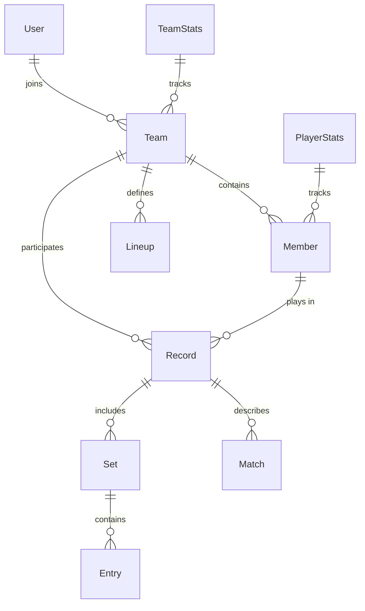
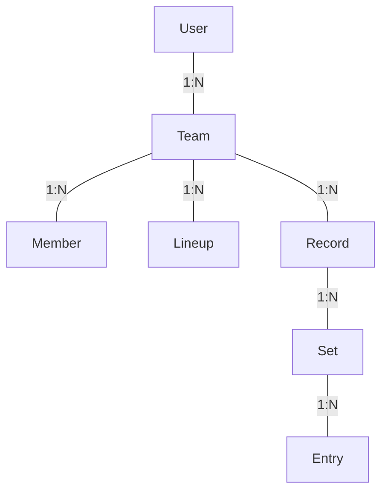

# 05. 數據模型 (Data Model)

## 0. 概述

本文件描述 VolleyBro 應用程式中使用的主要數據模型及其關係，旨在提供系統資料結構的完整藍圖。

---

## 1. 資料庫架構

VolleyBro 系統採用 **MongoDB** 作為 NoSQL 資料庫，選擇其原因包括：

- **靈活性**：支援非結構化與半結構化數據，適合比賽記錄與球員統計的動態需求。
- **擴展性**：便於隨著系統功能擴展而新增資料模型與屬性。
- **效能**：透過適當的索引策略優化查詢效率。

設計原則包括：

- 使用嵌套結構（如 `Record` 中的 `teams` 和 `sets`）減少關聯查詢。
- 透過參考（`ref`）實現模型間的關係（如 `User` 與 `Team`）。

---

## 2. 領域實體 (Domain Entities)

以下是 VolleyBro 系統中的主要實體及其屬性：

### 1. 用戶 (User)

```typescript
interface User {
  _id: string;
  name: string;
  email: string;
  emailVerified?: Date;
  image?: string;
  password?: string;
  teams: {
    joined: string[]; // 已加入的隊伍 ID
    inviting: string[]; // 收到邀請的隊伍 ID
  };
  info?: Record<string, unknown>;
  preferences?: Record<string, unknown>;
  createdAt?: Date;
  updatedAt?: Date;
}
```

### 2. 隊伍 (Team)

```typescript
interface Team {
  _id: string;
  name: string;
  nickname?: string;
  members: {
    _id: string;
    email?: string;
    role: Role; // MEMBER, OWNER, ADMIN
    user_id: string;
  }[];
  lineups: Lineup[];
  stats?: TeamStats[];
  createdAt?: Date;
  updatedAt?: Date;
}
```

#### 2.1 陣容 (Lineup)

```typescript
enum Position {
  NONE = "", // 未指定位置
  OH = "OH", // 主攻手
  MB = "MB", // 中間攔網手
  OP = "OP", // 副攻手
  S = "S", // 舉球員
  L = "L", // 自由球員
}

interface Lineup {
  options: {
    liberoReplaceMode: 0 | 1 | 2;
    liberoReplacePosition: Position;
  };
  starting: {
    _id: string;
    position: Position;
    sub?: { _id: string; entryIndex: { in?: number; out?: number } };
  }[];
  liberos: {
    _id: string;
    position: Position;
    sub?: { _id: string; entryIndex: { in?: number; out?: number } };
  }[];
  substitutes: {
    _id: string;
    sub?: { _id: string; entryIndex: { in?: number; out?: number } };
  }[];
}
```

#### 2.2 成員 (Member)

```typescript
interface Member {
  _id: string;
  team_id: string;
  name: string;
  number: number;
  info?: Record<string, unknown>;
  stats?: Record<string, unknown>;
  createdAt?: Date;
  updatedAt?: Date;
}
```

### 3. 比賽紀錄 (Record)

```typescript
interface Record {
  _id: string;
  win: boolean;
  team_id: string;
  info: Match;
  teams: {
    home: Team;
    away: Team;
  };
  sets: Set[];
  createdAt?: Date;
  updatedAt?: Date;
}
```

#### 3.1 賽事 (Match)

```typescript
interface Match {
  _id?: string;
  name?: string;
  number?: number;
  phase?: MatchPhase; // NONE, ELIM, SEED, QUAL, FINAL
  division?: MatchDivision; // NONE, MEN, WOMEN, MIXED
  category?: MatchCategory; // NONE, SENIOR, JUNIOR, YOUTH
  scoring: {
    setCount: number;
    decidingSetPoints: number;
  };
  location?: { city?: string; hall?: string };
  time?: { date?: string; start?: string; end?: string };
  weather?: { temperature: number };
}
```

#### 3.2 賽局 (Set)

```typescript
interface Set {
  win: boolean;
  lineups: {
    home: Lineup;
    away?: Lineup;
  };
  options: {
    serve: "home" | "away";
    time?: { start: string; end: string };
  };
  entries: Entry[]; // RALLY, SUBSTITUTION, TIMEOUT, CHALLENGE
}
```

#### 3.3 其他比賽紀錄相關實體

- **球員統計 (PlayerStats)**：記錄球員技術表現（如發球、攻擊等）。
- **隊伍統計 (TeamStats)**：記錄隊伍整體表現。
- **回合 (Rally)**、**替補 (Substitution)**、**暫停 (Timeout)**、**挑戰 (Challenge)**：比賽中的逐球紀錄與事件。

---

## 3. 數據庫模型 (Database Schemas)

系統使用 Mongoose 與 MongoDB 實現數據持久化，以下是主要模型的 Schema：

### 1. User Schema

```typescript
const userSchema = new Schema<UserDocument>(
  {
    name: { type: String, required: true, trim: true },
    email: { type: String, required: true, trim: true },
    emailVerified: { type: Date },
    image: { type: String },
    password: { type: String },
    teams: {
      joined: [{ type: Schema.Types.ObjectId, ref: "Team" }],
      inviting: [{ type: Schema.Types.ObjectId, ref: "Team" }],
    },
    info: { type: Object },
    preferences: { type: Object },
  },
  { timestamps: true }
);
userSchema.index({ email: 1 });
```

### 2. Team Schema

```typescript
const teamSchema = new Schema<TeamDocument>(
  {
    name: { type: String, required: true },
    nickname: { type: String },
    members: [
      {
        _id: { type: Schema.Types.ObjectId, ref: "Member" },
        email: { type: String },
        role: { type: String, enum: [Role.MEMBER, Role.OWNER, Role.ADMIN] },
        user_id: { type: Schema.Types.ObjectId, ref: "User" },
      },
    ],
    lineups: [lineupSchema],
    stats: [{ type: teamStatsSchema }],
  },
  { timestamps: true }
);
```

#### 2.1 Member Schema

```typescript
const memberSchema = new Schema<MemberDocument>(
  {
    team_id: { type: Schema.Types.ObjectId, ref: "Team", required: true },
    name: { type: String, required: true },
    number: { type: Number, required: true },
    info: { type: Object },
    stats: { type: Object },
  },
  { timestamps: true }
);
memberSchema.index({ team_id: 1 });
```

### 3. Record Schema

```typescript
const recordSchema = new Schema<RecordDocument>(
  {
    win: { type: Boolean },
    team_id: { type: Schema.Types.ObjectId, ref: "Team" },
    info: { type: matchSchema },
    teams: {
      home: { type: teamSchema },
      away: { type: teamSchema },
    },
    sets: [{ type: setSchema }],
  },
  { timestamps: true }
);
recordSchema.index({ team_id: 1 });
```

#### 3.1 Match Schema

```typescript
const matchSchema = new Schema<MatchDocument>({
  name: { type: String },
  number: { type: Number },
  phase: { type: Number, enum: MatchPhase, default: MatchPhase.NONE },
  division: { type: Number, enum: MatchDivision, default: MatchDivision.NONE },
  category: { type: Number, enum: MatchCategory, default: MatchCategory.NONE },
  scoring: {
    setCount: { type: Number, default: 3 },
    decidingSetPoints: { type: Number, default: 15 },
  },
  location: { city: { type: String }, hall: { type: String } },
  time: {
    date: { type: String },
    start: { type: String },
    end: { type: String },
  },
  weather: { temperature: { type: Number } },
});
```

#### 3.2 Set Schema

```typescript
const setSchema = new Schema<SetDocument>({
  win: { type: Boolean },
  lineups: {
    home: { type: lineupSchema },
    away: { type: lineupSchema },
  },
  options: {
    serve: { type: String, enum: ["home", "away"] },
    time: { start: { type: String }, end: { type: String } },
  },
  entries: [{ type: entrySchema }],
});
```

---

## 4. 資料流程

以下是系統中的主要資料流程：

- **使用者與隊伍**：
  - 使用者註冊後可創建或加入隊伍，更新 `User.teams.joined` 和 `Team.members`。
- **陣容配置**：
  - 管理者設定 `Team.lineups`，用於比賽中的人員安排。
- **比賽記錄**：
  - 比賽開始時創建 `Record`，記錄 `Match` 資訊、`Team` 數據與 `Set` 內容。
  - 比賽進行中，`Set.entries` 更新 `Rally`、`Substitution` 等事件，並同步影響 `PlayerStats` 和 `TeamStats`。

---

## 5. 實體關係圖 (Entity Relationship Diagram)



---

## 6. 資料驗證與約束

- **User**：`email` 必須為有效格式，`name` 不可為空。
- **Team**：`name` 必須唯一，`members.role` 限制於枚舉值。
- **Member**：`number` 在同一隊伍中必須唯一。
- **Match**：`setCount` 和 `decidingSetPoints` 必須為正整數。
- **Lineup**：`starting` 人數需符合比賽規則（通常為 6 人）。

---

## 7. 索引策略

- `userSchema.index({ email: 1 })`：加速用戶查詢。
- `memberSchema.index({ team_id: 1 })`：加速成員查詢。
- `recordSchema.index({ team_id: 1 })`：加速比賽記錄查詢。

---

## 8. 數據關聯


