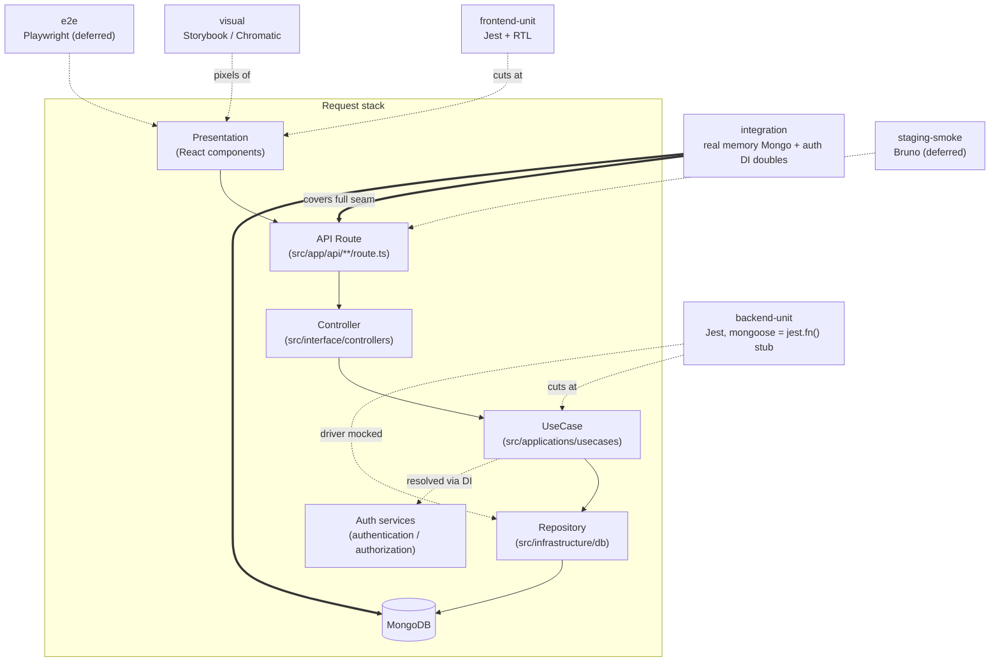

# Testing Strategy

This document defines how tests are written across each Clean Architecture layer in VolleyBro. Consult it before writing a new test file.

See also: [Architecture Overview](./architecture.md) · [Maintenance Policy](./maintenance-policy.md)

---

## Layer Testing Table

Each layer has a designated testing school and defined mock boundaries.

| Layer                                     | School    | What to mock                                                     | What stays real                                    | Example                                 |
| ----------------------------------------- | --------- | ---------------------------------------------------------------- | -------------------------------------------------- | --------------------------------------- |
| Entity (`src/entities/`)                  | Classical | Nothing                                                          | Everything                                         | Pure logic, validation                  |
| UseCase (`src/applications/`)             | Classical | Repository & service interfaces                                  | Entity logic, use case orchestration               | Inject mock repo, verify output         |
| Infrastructure (`src/infrastructure/`)    | Classical | Mongoose/`mongodb` (fully stubbed by `jest.setup.backend.ts`)    | Repository mapping logic                           | No DB; assert on driver call shapes     |
| Controller (`src/interface/controllers/`) | London    | UseCase classes                                                  | Controller orchestration                           | Stub use case, verify delegation        |
| Component (`src/components/`)             | Classical | API calls, custom hooks (SWR/Redux)                              | Rendering, user interaction, DOM                   | Mock `fetch`/hooks, test behavior       |
| Integration (`test/integration/`)         | Classical | Auth services (DI doubles); `next/headers`, `@/lib/auth` imports | Route → controller → use case → repo → **real DB** | Real route handler against memory Mongo |

### School Emphasis

**Classical (state verification)** — Assert on the _output_ or _resulting state_ after exercising the SUT with real collaborators. Catches integration issues but tests may be slower, and failures may span multiple collaborators, making root causes harder to isolate. This is the default school for all layers except Controller.

**London (behavior verification)** — Assert that the SUT _called the right collaborators with the right arguments_. Provides precise failure messages but couples tests to implementation details. Used only for Controller, where testing through real use cases would duplicate application-layer coverage.

---

## Test Tiers Across the Request Stack

The unit tiers above each isolate a single layer. The **integration tier** wires the whole request stack together against a real database — the seam the mongoose-stubbed backend project cannot reach. Deferred tiers (staging smoke via Bruno, end-to-end via Playwright) are planned but not yet implemented.

Per-layer reality under each tier:

| Layer        | frontend-unit | backend-unit         | integration               | visual   |
| ------------ | ------------- | -------------------- | ------------------------- | -------- |
| Presentation | **real**      | —                    | —                         | **real** |
| API Route    | —             | real (driver mocked) | **real**                  | —        |
| Controller   | —             | real / test-double   | **real**                  | —        |
| UseCase      | —             | **real**             | **real**                  | —        |
| Repository   | —             | real (mongoose stub) | **real**                  | —        |
| Database     | —             | **mocked** (jest.fn) | **real** (memory Mongo)   | —        |
| Auth         | —             | test-double          | **DI double** (fake user) | —        |

The integration tier is what closes the previously-uncovered **route ↔ usecase ↔ repository ↔ DB** persistence seam: it drives a real `NextRequest` through the exported route handler so route-layer request mapping (`si`/`ei` params, JSON body, forwarded fields) is exercised end to end against a real Mongoose write/read round-trip.

---

## Frontend Testing Split

Frontend component tests are split across two tools with distinct responsibilities.

### Jest + React Testing Library (behavioral)

- Test user interactions, conditional rendering, and accessibility (`jest-axe`)
- Assert on visible output and DOM state — not on CSS classes or computed styles
- **No CSS assertions**: Tailwind class names change independently of visual output; asserting on them creates false negatives and false positives

### Storybook + Chromatic (visual regression)

- Catch layout, spacing, color, and responsive breakpoint regressions via screenshot diffing
- Stories serve as living documentation and visual test cases
- Run Chromatic on CI to gate visual changes
- Stories do **not** include `play()` functions — Storybook is not used for interaction testing
- `fn()` from `storybook/test` is used only for action spying in the Actions panel, not for assertions
- The behavioral ↔ visual split is intentional: Jest + RTL owns interactions, Chromatic owns pixels

**Why the split?** CSS assertions in Jest are brittle — a class rename breaks the test with no actual visual difference. Chromatic catches real regressions by comparing rendered pixels. Adding play functions to stories would duplicate the behavioral coverage that Jest + RTL already provides.

---

## Mock Boundaries

Defines what belongs in shared setup files versus inline per-test mocks.

### Setup Files

| File                        | What it does                                                                                                                                             | Used by                                                       |
| --------------------------- | -------------------------------------------------------------------------------------------------------------------------------------------------------- | ------------------------------------------------------------- |
| `jest.setup.backend.ts`     | Replaces `mongoose`/`mongodb`/`bson` with `jest.fn()` stubs — no database is contacted                                                                   | Backend project (`jest.config.ts` `projects.backend`)         |
| `jest.setup.frontend.ts`    | Browser APIs (`matchMedia`, `ResizeObserver`, `IntersectionObserver`)                                                                                    | Frontend project (`jest.config.ts` `projects.frontend`)       |
| `jest.setup.integration.ts` | Starts a real in-memory MongoDB, connects mongoose, clears collections between tests; stubs `@/lib/auth` + `next/headers` so the container is importable | Integration project (`jest.config.ts` `projects.integration`) |

The integration project deliberately does **not** load `jest.setup.backend.ts`: it needs the real Mongoose driver, not the stub. `jest.config.ts` also exposes `globalThis.AsyncLocalStorage` (and forwards it to workers via `jest.preload.integration.mjs`) because Next's server modules — pulled in when real route handlers are imported — capture it at load time.

**Rule:** A mock belongs in a setup file when _every_ test in that project needs it to run at all. Browser API stubs and DB connection setup qualify. Business-logic fakes do not.

### Inline Mocks (per test or per file)

- Repository interfaces (UseCase tests)
- UseCase classes (Controller tests)
- `fetch` / SWR hooks / Redux store (Component tests)
- Any mock whose behavior varies between test cases

**Rule:** If the mock's return value changes between tests, keep it inline. Do not reach into setup files to configure per-test behavior — it makes tests order-dependent and hard to read.

---

## Story Coverage Requirements

| Layer                                | Story required                                    | Story location        |
| ------------------------------------ | ------------------------------------------------- | --------------------- |
| `ui/`                                | **Yes** — every component                         | `src/stories/ui/`     |
| `custom/`                            | **Yes** — cross-domain composites                 | `src/stories/custom/` |
| `{domain}/` (e.g., `team/`, `user/`) | No — behavioral coverage via Jest, visual via E2E | —                     |

New components in `ui/` and `custom/` must include a Storybook story before the PR is merged. Domain components are exercised through their parent feature flows.

---

## Quick Reference

| I am writing a…                  | Use                                 | School    | Mock                            |
| -------------------------------- | ----------------------------------- | --------- | ------------------------------- |
| Entity (pure logic)              | Jest                                | Classical | Nothing                         |
| Use case                         | Jest                                | Classical | Repository / service interfaces |
| Repository (infrastructure)      | Jest                                | Classical | DB driver (global setup)        |
| API controller                   | Jest                                | London    | Use case classes                |
| React component (behavior)       | Jest + RTL                          | Classical | `fetch`, SWR hooks, Redux store |
| Full request stack + persistence | Jest (`*.itest.ts`, real memory DB) | Classical | Auth services (DI doubles)      |
| React component (visual)         | Storybook story                     | —         | —                               |
| New `ui/` or `custom/` component | Story **required**                  | —         | —                               |
| New domain component             | Story optional (Jest is sufficient) | —         | —                               |

**Do:** Assert on rendered output and resulting state.  
**Don't:** Assert on CSS class names or implementation call order (unless Controller layer).
