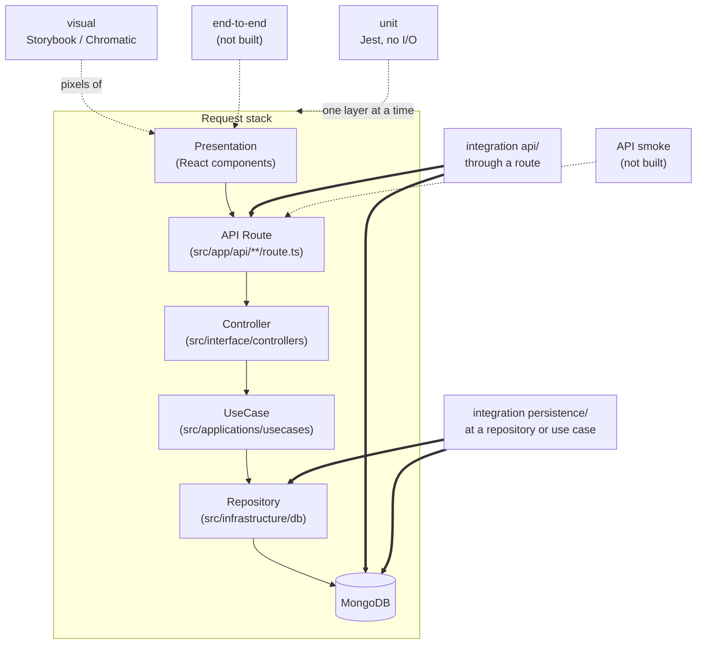

# Testing Strategy

This document defines which tier a test belongs to, what it may replace, and where it lives. Consult it before writing a new test file. The decisions behind it are ADR-0085 to ADR-0092 in `blueprint/content/decisions/`.

See also: [Architecture Overview](./architecture.md) · [Maintenance Policy](./maintenance-policy.md)

---

## Test Tiers

A test's tier follows from what it touches, not from its folder or its entry point (ADR-0085). The file name states the tier, and `pnpm check:workflow` fails on a test file whose suffix does not match its directory (ADR-0091).

| Tier        | What it touches                                                                             | File                                                         | Runs with                                            |
| ----------- | ------------------------------------------------------------------------------------------- | ------------------------------------------------------------ | ---------------------------------------------------- |
| Unit        | One process, no I/O, however many real collaborators                                        | `*.test.ts(x)` beside the code in `src/`                     | `pnpm test` (Jest `backend` and `frontend` projects) |
| Integration | At least one real out-of-process dependency, the database here, and proving it is the point | `*.itest.ts` under `test/integration/api/` or `persistence/` | `pnpm test:integration` (Jest `integration` project) |
| End-to-end  | A real client, the web app in a browser or a mobile app, against a deployed backend         | `*.e2e.ts` under `test/e2e/`                                 | Not built yet                                        |
| API smoke   | A deployed backend with no client: real sign-in, HTTP handling, the hosted database         | —                                                            | Not built yet                                        |

End-to-end tests cover critical paths only, one suite per client. API smoke proves once, for every client, what only a deployed backend can show. Both wait on a test-only sign-in path that must never reach production.

```mermaid
flowchart TB
    subgraph stack["Request stack"]
        direction TB
        P["Presentation<br/>(React components)"]
        R["API Route<br/>(src/app/api/**/route.ts)"]
        C["Controller<br/>(src/interface/controllers)"]
        U["UseCase<br/>(src/applications/usecases)"]
        Repo["Repository<br/>(src/infrastructure/db)"]
        DB[("MongoDB")]
        P --> R --> C --> U --> Repo --> DB
    end

    unit["unit<br/>Jest, no I/O"] -.->|"one layer at a time"| stack
    api["integration api/<br/>through a route"] ==> R
    api ==> DB
    persistence["integration persistence/<br/>at a repository or use case"] ==> Repo
    persistence ==> DB
    visual["visual<br/>Storybook / Chromatic"] -.->|"pixels of"| P
    smoke["API smoke<br/>(not built)"] -.-> R
    e2e["end-to-end<br/>(not built)"] -.-> P
```

---

## Unit Tests

### What a unit test may replace

A unit test replaces only what is out of process — the network and the database — and framework runtime its environment cannot run, such as the Next router under jsdom (ADR-0086). Everything else stays real.

| Layer                                     | School    | What to replace                                   | What stays real                              |
| ----------------------------------------- | --------- | ------------------------------------------------- | -------------------------------------------- |
| Entity (`src/entities/`)                  | Classical | Nothing                                           | Everything                                   |
| UseCase (`src/applications/`)             | Classical | Repository and service ports                      | Entity logic, use-case orchestration         |
| Infrastructure (`src/infrastructure/`)    | Classical | Nothing: mapping and error translation are pure   | Mapping between documents and entities       |
| Controller (`src/interface/controllers/`) | London    | Use cases                                         | Controller orchestration                     |
| API route (`src/app/api/`)                | Classical | Controllers, the database connection, the session | Request parsing, validation, error responses |
| Component and hook (`src/components/`)    | Classical | HTTP, intercepted with MSW; `next/navigation`     | Child components, hooks, the Redux store     |

**Classical (state verification)** asserts on the output or resulting state after exercising the code with real collaborators. It is the default.

**London (behaviour verification)** asserts that the code called the right collaborator with the right arguments. Controllers are the one exception that uses it, because a controller today only forwards to one use case; they move to real use cases when controllers take over request parsing and mapping.

Repository query and write behaviour is proven in `persistence/` integration tests, not against a stubbed driver (ADR-0090). A jsdom limitation that forces a mock of the repository's own code is named in the test file where it happens.

Some existing tests predate these rules and are being brought to them by the testing-tiers Migration: `test/setup/backend.ts` stubs `mongoose` and `mongodb` for every backend test, `test/setup/shared.ts` replaces `fetch` globally, and some component tests mock `apiClient`, `fetch` or their own hooks. Do not copy any of these into a new test.

### API routes

Each API route whose handler the repository writes has exactly one unit test file, `__tests__/route.test.ts` beside its `route.ts`, holding every unit case for that route (ADR-0089). Request-schema rejections belong there: validation completes before any use case runs, so a case asserting the 400 `VALIDATION` response and that the controller was not called also shows nothing was written.

A route whose handler a library generates whole, such as the Better Auth catch-all, has no unit test (ADR-0089).

Mock the controller module, `@/infrastructure/db/mongoose/connect-to-mongodb`, and `@/lib/auth` for routes behind `withAuth`; build requests with `routeRequest` from `@/test-utils/route-request`. After `jest.resetModules()`, import error classes again alongside the route, or `instanceof` in the error handler will not recognise them.

---

## Integration Tests

Integration tests run against a disposable instance of the production database engine and topology (ADR-0087): one in-memory replica set (`MongoMemoryReplSet`) for each test run, with a fresh database for each test file. The replica set supports transactions, so a write that must be atomic can be proven here. Auth services stay DI doubles: `useFakeAuth` from `test/integration/support/auth.ts` rebinds them in the container.

The directory says what a test proves (ADR-0088):

- **`test/integration/api/`** — assertions that depend on a real database read or write reached through a route. Arrange and read data only through routes and repository interfaces, never through the driver, a Mongoose schema, or a helper that writes through them.
- **`test/integration/persistence/`** — database behaviour itself, entering at a repository or use case. These tests may use the driver directly.
- **`test/integration/support/`** — helpers, with no tier suffix.

A route test whose assertion does not depend on the database is a route unit test instead.

Collections the models own are emptied after each test. A test that writes to a collection no model owns uses a name of its own.

**What needs a real sign-in.** Only rendered auth-gated pages do. Server behaviour runs through `test/integration/` with `useFakeAuth`; client logic runs in the jsdom `frontend` project. For real-device acceptance, deploy the working tree to the unprotected `volleybro-test` project with `git status --short && pnpm dlx vercel --prod --yes`; the CLI is already authenticated and needs no global install. Hand out `https://volleybro-test.vercel.app`, never the org-suffixed alias, which redirects to SSO.

---

## Frontend Testing Split

Frontend component tests are split across two tools with distinct responsibilities.

### Jest + React Testing Library (behavioral)

- Test user interactions, conditional rendering, and accessibility (`jest-axe`)
- Assert on visible output and DOM state — not on CSS classes or computed styles
- **No CSS assertions**: Tailwind class names change independently of visual output; asserting on them creates false negatives and false positives

### Storybook + Chromatic (visual regression)

- Catch layout, spacing, color, and responsive breakpoint regressions via screenshot diffing
- Stories serve as living documentation and visual test cases
- Run Chromatic on CI to gate visual changes, with TurboSnap (`onlyChanged`) so a trigger snapshots only the stories the change can reach — the workflow's path filter admits edits that are not visual at all
- Stories do **not** include `play()` functions — Storybook is not used for interaction testing
- `fn()` from `storybook/test` is used only for action spying in the Actions panel, not for assertions
- The behavioral ↔ visual split is intentional: Jest + RTL owns interactions, Chromatic owns pixels

**Why the split?** CSS assertions in Jest are brittle — a class rename breaks the test with no actual visual difference. Chromatic catches real regressions by comparing rendered pixels. Adding play functions to stories would duplicate the behavioral coverage that Jest + RTL already provides.

---

## Mock Boundaries

Defines what belongs in shared setup files versus inline per-test mocks.

### Setup Files

Jest setup files live under `test/setup/`; only `jest.config.ts` stays at the repository root (ADR-0091).

| File                                 | What it does                                                                                                                                                               | Used by               |
| ------------------------------------ | -------------------------------------------------------------------------------------------------------------------------------------------------------------------------- | --------------------- |
| `test/setup/shared.ts`               | Replaces global `fetch`; silences known third-party warnings                                                                                                               | backend, frontend     |
| `test/setup/backend.ts`              | Replaces `mongoose`, `mongodb` and `bson` with stubs                                                                                                                       | backend               |
| `test/setup/frontend.ts`             | Browser APIs jsdom lacks (`matchMedia`, `ResizeObserver`, `IntersectionObserver`, pointer capture); `jest-dom` and `jest-axe`                                              | frontend              |
| `test/setup/integration.global.ts`   | Starts the run's replica set in Jest's own process and passes its URI to the workers                                                                                       | integration           |
| `test/setup/integration.teardown.ts` | Stops the replica set                                                                                                                                                      | integration           |
| `test/setup/integration.ts`          | Connects each test file to a database of its own, empties model collections between tests, drops the database at the end; makes `@/lib/auth` and `next/headers` importable | integration           |
| `test/setup/integration.preload.js`  | Exposes `globalThis.AsyncLocalStorage` before any module loads, because Next's server modules capture it at import time                                                    | integration (preload) |

The replica set starts in global setup because the driver that initiates it cannot complete its handshake inside a Jest test environment; one server per run also keeps the run short. The integration project does **not** load `backend.ts`: it needs the real driver.

**Rule:** A mock belongs in a setup file when _every_ test in that project needs it to run at all. Browser API stubs and database connection setup qualify. Business-logic fakes do not.

### Inline Mocks (per test or per file)

- Repository ports (use-case tests)
- Use cases (controller tests)
- Controllers and the session (route tests)
- Any mock whose behavior varies between test cases

**Rule:** If the mock's return value changes between tests, keep it inline. Do not reach into setup files to configure per-test behavior — it makes tests order-dependent and hard to read.

---

## Story Coverage Requirements

| Layer                                | Story required                                    | Story location        |
| ------------------------------------ | ------------------------------------------------- | --------------------- |
| `ui/`                                | **Yes** — every component                         | `src/stories/ui/`     |
| `custom/`                            | **Yes** — cross-domain composites                 | `src/stories/custom/` |
| `{domain}/` (e.g., `team/`, `user/`) | No — behavioral coverage via Jest, visual via E2E | —                     |

New components in `ui/` and `custom/` must include a Storybook story before the PR is merged. Domain components are exercised through their parent feature flows.

---

## Where Tests Run

CI runs every check on every pull request and is the authority (ADR-0092). Locally, `pnpm verify` runs format, lint, type checks, workflow conformance and unit tests. `pnpm verify:all` runs each other lane — the app build and unit tests, the workflow tests, the integration tests, the Blueprint tests — only when the diff against `dev` reaches it, and every lane when root configuration changed; `pnpm verify:all --full` runs everything. No local gate builds the Blueprint site. The integration tests download a `mongodb-memory-server` binary on first run.

---

## Quick Reference

| I am writing a…                          | File                                        | School    | Replace                         |
| ---------------------------------------- | ------------------------------------------- | --------- | ------------------------------- |
| Entity (pure logic)                      | `*.test.ts` in `src/entities/`              | Classical | Nothing                         |
| Use case                                 | `*.test.ts` in `src/applications/`          | Classical | Repository and service ports    |
| Document ↔ entity mapping                | `*.test.ts` in `src/infrastructure/`        | Classical | Nothing                         |
| Controller                               | `*.test.ts` in `src/interface/controllers/` | London    | Use cases                       |
| API route request handling               | `__tests__/route.test.ts` beside `route.ts` | Classical | Controller, connection, session |
| React component or hook (behavior)       | `*.test.tsx` beside the component           | Classical | HTTP (MSW), `next/navigation`   |
| A database read or write through a route | `test/integration/api/*.itest.ts`           | Classical | Auth services (DI doubles)      |
| Repository or transaction behaviour      | `test/integration/persistence/*.itest.ts`   | Classical | Auth services (DI doubles)      |
| React component (visual)                 | Storybook story                             | —         | —                               |
| New `ui/` or `custom/` component         | Story **required**                          | —         | —                               |
| New domain component                     | Story optional (Jest is sufficient)         | —         | —                               |

**Do:** Assert on rendered output and resulting state.  
**Don't:** Assert on CSS class names or implementation call order (unless Controller layer).
