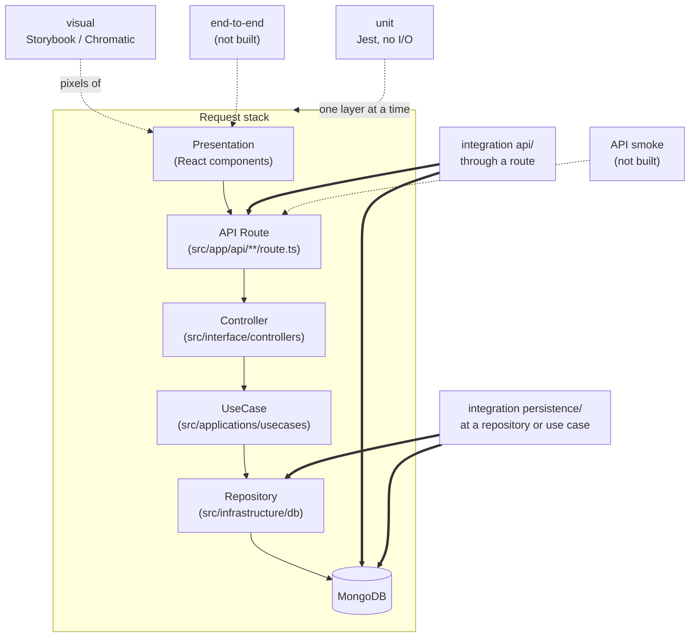

# Testing Strategy

This document defines which tier a test belongs to, what it may replace, and where it lives. Consult it before writing a new test file. The decisions behind it are ADR-0085 to ADR-0092 in `blueprint/content/decisions/`.

See also: [Maintenance Policy](./maintenance-policy.md)

---

## Test Tiers

A test's tier follows from what it touches, not from its folder or its entry point (ADR-0085). The file name states the tier, and `pnpm check:workflow` fails on a test file whose suffix does not match its directory (ADR-0091).

| Tier        | What it touches                                                                             | File                                                         | Runs with                                            |
| ----------- | ------------------------------------------------------------------------------------------- | ------------------------------------------------------------ | ---------------------------------------------------- |
| Unit        | One process, no I/O, however many real collaborators                                        | `*.test.ts(x)` beside the code in `src/`                     | `pnpm test` (Jest `backend` and `frontend` projects) |
| Integration | At least one real out-of-process dependency, the database here, and proving it is the point | `*.itest.ts` under `test/integration/api/` or `persistence/` | `pnpm test:integration` (Jest `integration` project) |
| End-to-end  | A real client, the web app in a browser or a mobile app, against a deployed backend         | `*.e2e.ts` under `test/e2e/`                                 | Not built yet                                        |
| API smoke   | A deployed backend with no client: real sign-in, HTTP handling, the hosted database         | —                                                            | Not built yet                                        |

End-to-end tests cover critical paths only, one suite per client. API smoke proves once, for every client, what only a deployed backend can show. Both wait on a test-only sign-in path that must never reach production.


```mermaid
flowchart TB
    subgraph stack["Request stack"]
        direction TB
        P["Presentation<br/>(React components)"]
        R["API Route<br/>(src/app/api/**/route.ts)"]
        C["Controller<br/>(src/interface/controllers)"]
        U["UseCase<br/>(src/applications/usecases)"]
        Repo["Repository<br/>(src/infrastructure/db)"]
        DB[("MongoDB")]
        P --> R --> C --> U --> Repo --> DB
    end

    unit["unit<br/>Jest, no I/O"] -.->|"one layer at a time"| stack
    api["integration api/<br/>through a route"] ==> R
    api ==> DB
    persistence["integration persistence/<br/>at a repository or use case"] ==> Repo
    persistence ==> DB
    visual["visual<br/>Storybook / Chromatic"] -.->|"pixels of"| P
    smoke["API smoke<br/>(not built)"] -.-> R
    e2e["end-to-end<br/>(not built)"] -.-> P
```

---

## Test Value

A test earns its maintenance cost only by protecting observable behaviour, a credible regression, or an independent contract. The `test-audit` skill (`.agents/skills/test-audit/`) holds the method; this section is the rule it serves.

**Before writing a test,** answer five questions; a missing answer means the test is not written yet:

1. What observable behaviour, invariant, or contract does it protect?
2. What credible regression makes it fail?
3. Why does existing coverage not catch that failure already? Each contract has one owner test at the tier this document assigns; another tier needs a risk of its own.
4. Does it need a production seam — an export, flag, or hook — that no production caller needs? Then test at the real boundary instead.
5. Does a fixture, helper, or handler for it already exist in `test/support/`? Reuse it.

A test that asserts values it built itself, restates the implementation, or would break under a behaviour-preserving refactor fails the gate. A regression test must fail on the code before the fix.

**Before deleting or moving a test,** record what it can detect, which test now owns that contract (the keeper), or why no contract exists. A Sharded Change batch that deletes or moves tests follows the skill's campaign: a per-test ledger, a keeper per contract, and a preservation review in which each contract left to its keeper is proven by one deliberate mutation of the production code that turns the keeper red. The ledger becomes the Review tab's deletion table. Per-file coverage shows code still runs; only the mutation shows a broken contract is still caught.

---

## Unit Tests

### What a unit test may replace

A unit test replaces only what is out of process — the network and the database — and framework runtime its environment cannot run, such as the Next router under jsdom (ADR-0086). Everything else stays real.

| Layer                                     | School    | What to replace                                   | What stays real                              |
| ----------------------------------------- | --------- | ------------------------------------------------- | -------------------------------------------- |
| Entity (`src/entities/`)                  | Classical | Nothing                                           | Everything                                   |
| UseCase (`src/applications/`)             | Classical | Repository and service ports                      | Entity logic, use-case orchestration         |
| Infrastructure (`src/infrastructure/`)    | Classical | Nothing: mapping and error translation are pure   | Mapping between documents and entities       |
| Controller (`src/interface/controllers/`) | London    | Use cases                                         | Controller orchestration                     |
| API route (`src/app/api/`)                | Classical | Controllers, the database connection, the session | Request parsing, validation, error responses |
| Component and hook (`src/components/`)    | Classical | HTTP, intercepted with MSW; `next/navigation`     | Child components, hooks, the Redux store     |

**Classical (state verification)** asserts on the output or resulting state after exercising the code with real collaborators. It is the default.

**London (behaviour verification)** asserts that the code called the right collaborator with the right arguments. Controllers are the one exception that uses it, because a controller today only forwards to one use case; they move to real use cases when controllers take over request parsing and mapping.

Repository query and write behaviour is proven in `persistence/` integration tests, not against a stubbed driver (ADR-0090). A jsdom limitation that forces a mock of the repository's own code is named in the test file where it happens.

### Answering HTTP with MSW

`test/support/msw/server.ts` is one MSW server for the `frontend` project. A test adds its handlers with `server.use(http.get(...))`, and they are dropped after each test. A request no handler answers fails the test.

- MSW matches a path and ignores its query string; read `new URL(request.url).searchParams` inside the handler to assert it.
- To hold a request in flight, await a promise in the handler and resolve it from the test; `delay("infinite")` never answers.
- A test that renders a real SWR hook wraps it in `SwrIsolation` from `@test/support/react/swr-isolation`, so one test's cached response never answers another.
- `jest.useFakeTimers()` stops MSW from answering; use `jest.useFakeTimers({ doNotFake: ["nextTick"] })`.

### API routes

Each API route whose handler the repository writes has exactly one unit test file, `__tests__/route.test.ts` beside its `route.ts`, holding every unit case for that route (ADR-0089). Request-schema rejections belong there: validation completes before any use case runs, so a case asserting the 400 `VALIDATION` response and that the controller was not called also shows nothing was written.

A route whose handler a library generates whole, such as the Better Auth catch-all, has no unit test (ADR-0089).

Mock the controller module, `@/infrastructure/db/mongoose/connect-to-mongodb`, and `@/lib/auth` for routes behind `withAuth`; build requests with `routeRequest` from `@test/support/http/route-request`. After `jest.resetModules()`, import error classes again alongside the route, or `instanceof` in the error handler will not recognise them.

---

## Integration Tests

Integration tests run against a disposable instance of the production database engine and topology (ADR-0087): one in-memory replica set (`MongoMemoryReplSet`) for each test run, with a fresh database for each test file. The replica set supports transactions, so a write that must be atomic can be proven here. Auth services stay DI doubles: `useFakeAuth` from `test/integration/support/auth.ts` rebinds them in the container.

The directory says what a test proves (ADR-0088):

- **`test/integration/api/`** — assertions that depend on a real database read or write reached through a route. Arrange and read data only through routes and repository interfaces, never through the driver, a Mongoose schema, or a helper that writes through them.
- **`test/integration/persistence/`** — database behaviour itself, entering at a repository or use case. These tests may use the driver directly.
- **`test/integration/support/`** — helpers, with no tier suffix.

A route test whose assertion does not depend on the database is a route unit test instead.

Collections the models own are emptied after each test. A test that writes to a collection no model owns uses a name of its own.

**What needs a real sign-in.** Only rendered auth-gated pages do. Server behaviour runs through `test/integration/` with `useFakeAuth`; client logic runs in the jsdom `frontend` project. For real-device acceptance, confirm the deployment project is the unprotected `volleybro-test`, not the formal `volleybro` project. Use the globally installed Vercel CLI when available; fall back to `pnpm dlx vercel` only when it is absent. Confirm authentication before deploying; `--prod` selects the test project's Production target, not the formal site's project.

```sh
git status --short && {
  if command -v vercel >/dev/null 2>&1; then
    vercel --prod --yes
  else
    pnpm dlx vercel --prod --yes
  fi
}
```

Do not fall back after an installed CLI fails: resolve authentication or deployment errors instead. Hand out `https://volleybro-test.vercel.app`, never the org-suffixed alias, which redirects to SSO.

---

## Frontend Testing Split

Frontend component tests are split across two tools with distinct responsibilities.

### Jest + React Testing Library (behavioral)

- Test user interactions, conditional rendering, and accessibility (`jest-axe`)
- Assert on visible output and DOM state — not on CSS classes or computed styles
- Query by role or text first; reach for a kebab-case `data-testid` only for a structural element with no accessible role, and add it when the component or its skeleton is created
- **No CSS assertions**: Tailwind class names change independently of visual output; asserting on them creates false negatives and false positives

### Storybook + Chromatic (visual regression)

- Catch layout, spacing, color, and responsive breakpoint regressions via screenshot diffing
- Stories serve as living documentation and visual test cases
- Run Chromatic on CI to gate visual changes, with TurboSnap (`onlyChanged`) so a trigger snapshots only the stories the change can reach — the workflow's path filter admits edits that are not visual at all
- Stories do **not** include `play()` functions — Storybook is not used for interaction testing
- `fn()` from `storybook/test` is used only for action spying in the Actions panel, not for assertions
- The behavioral ↔ visual split is intentional: Jest + RTL owns interactions, Chromatic owns pixels

**Why the split?** CSS assertions in Jest are brittle — a class rename breaks the test with no actual visual difference. Chromatic catches real regressions by comparing rendered pixels. Adding play functions to stories would duplicate the behavioral coverage that Jest + RTL already provides.

---

## Test Support Code

Shared test code lives under `test/support/`, outside `src/`, so production tooling ignores it, and `jest.config.ts` leaves `test/` out of coverage. Import it as `@test/support/...`. It is sorted by what a helper is, not by which test uses it:

| Directory   | Holds                                                      | Example                             |
| ----------- | ---------------------------------------------------------- | ----------------------------------- |
| `fixtures/` | Builders that return domain data, `createX(overrides?)`    | `createGame`                        |
| `doubles/`  | Mock repositories and services for use-case tests          | `createMockTeamRepository`          |
| `msw/`      | The MSW server and handlers for this application's own API | `answerRallies`                     |
| `react/`    | Render wrappers and providers                              | `SwrIsolation`, `renderEditingGame` |
| `http/`     | Request builders for route tests                           | `routeRequest`                      |
| `dom/`      | Walkers over rendered output                               | `collect`                           |

`test/setup/` wires Jest and no test imports it. `test/integration/support/` needs the database driver, so only integration tests import it.

A helper starts inside the test file that needs it. When a second test file needs the same one, move it into `test/support/` and delete both copies; never copy it. Look in `test/support/` before writing any helper.

---

## Mock Boundaries

Defines what belongs in shared setup files versus inline per-test mocks.

### Setup Files

Jest setup files live under `test/setup/`; only `jest.config.ts` stays at the repository root (ADR-0091).

| File                                 | What it does                                                                                                                                                               | Used by               |
| ------------------------------------ | -------------------------------------------------------------------------------------------------------------------------------------------------------------------------- | --------------------- |
| `test/setup/shared.ts`               | Silences known third-party warnings                                                                                                                                        | backend, frontend     |
| `test/setup/backend.ts`              | Replaces `mongoose`, `mongodb` and `bson` with stubs                                                                                                                       | backend               |
| `test/setup/frontend.ts`             | Browser APIs jsdom lacks (`matchMedia`, `ResizeObserver`, `IntersectionObserver`, pointer capture, `setImmediate`); `jest-dom` and `jest-axe`; starts the MSW server       | frontend              |
| `test/setup/integration.global.ts`   | Starts the run's replica set in Jest's own process and passes its URI to the workers                                                                                       | integration           |
| `test/setup/integration.teardown.ts` | Stops the replica set                                                                                                                                                      | integration           |
| `test/setup/integration.ts`          | Connects each test file to a database of its own, empties model collections between tests, drops the database at the end; makes `@/lib/auth` and `next/headers` importable | integration           |
| `test/setup/integration.preload.js`  | Exposes `globalThis.AsyncLocalStorage` before any module loads, because Next's server modules capture it at import time                                                    | integration (preload) |

The replica set starts in global setup because the driver that initiates it cannot complete its handshake inside a Jest test environment; one server per run also keeps the run short. The integration project does **not** load `backend.ts`: it needs the real driver.

**Rule:** A mock belongs in a setup file when _every_ test in that project needs it to run at all. Browser API stubs and database connection setup qualify. Business-logic fakes do not.

### Inline Mocks (per test or per file)

- Repository ports (use-case tests)
- Use cases (controller tests)
- Controllers and the session (route tests)
- Any mock whose behavior varies between test cases

**Rule:** If the mock's return value changes between tests, keep it inline. Do not reach into setup files to configure per-test behavior — it makes tests order-dependent and hard to read.

---

## Story Coverage Requirements

| Layer                                | Story required                                    | Story location        |
| ------------------------------------ | ------------------------------------------------- | --------------------- |
| `ui/`                                | **Yes** — every component                         | `src/stories/ui/`     |
| `custom/`                            | **Yes** — cross-domain composites                 | `src/stories/custom/` |
| `{domain}/` (e.g., `team/`, `user/`) | No — behavioral coverage via Jest, visual via E2E | —                     |

New components in `ui/` and `custom/` must include a Storybook story before the PR is merged. Domain components are exercised through their parent feature flows.

---

## Where Tests Run

CI runs every check on every pull request and is the authority (ADR-0092). Locally, `pnpm verify` runs format, lint, type checks, workflow conformance and unit tests. `pnpm verify:all` runs each other lane — the app build and unit tests, the workflow tests, the integration tests, the Blueprint tests — only when the diff against `dev` reaches it, and every lane when root configuration changed; `pnpm verify:all --full` runs everything. No local gate builds the Blueprint site. The integration tests download a `mongodb-memory-server` binary on first run.

---

## Quick Reference

| I am writing a…                          | File                                        | School    | Replace                         |
| ---------------------------------------- | ------------------------------------------- | --------- | ------------------------------- |
| Entity (pure logic)                      | `*.test.ts` in `src/entities/`              | Classical | Nothing                         |
| Use case                                 | `*.test.ts` in `src/applications/`          | Classical | Repository and service ports    |
| Document ↔ entity mapping                | `*.test.ts` in `src/infrastructure/`        | Classical | Nothing                         |
| Controller                               | `*.test.ts` in `src/interface/controllers/` | London    | Use cases                       |
| API route request handling               | `__tests__/route.test.ts` beside `route.ts` | Classical | Controller, connection, session |
| React component or hook (behavior)       | `*.test.tsx` beside the component           | Classical | HTTP (MSW), `next/navigation`   |
| A database read or write through a route | `test/integration/api/*.itest.ts`           | Classical | Auth services (DI doubles)      |
| Repository or transaction behaviour      | `test/integration/persistence/*.itest.ts`   | Classical | Auth services (DI doubles)      |
| React component (visual)                 | Storybook story                             | —         | —                               |
| New `ui/` or `custom/` component         | Story **required**                          | —         | —                               |
| New domain component                     | Story optional (Jest is sufficient)         | —         | —                               |

**Do:** Assert on rendered output and resulting state.  
**Don't:** Assert on CSS class names or implementation call order (unless Controller layer).
