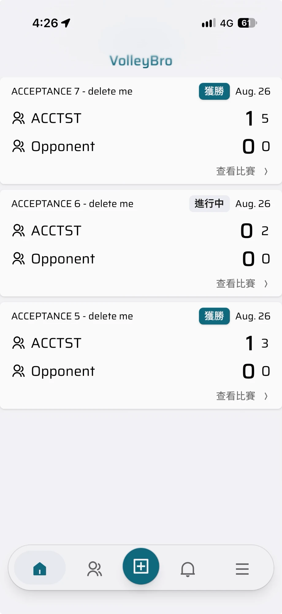
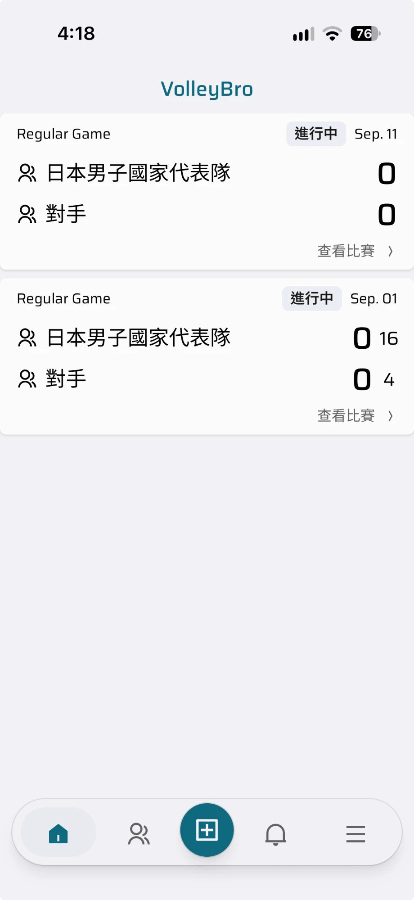

export const scenarios = [
  { id: "S1", given: "the tabs home page", when: "it is at rest", then: "the status bar is the background colour and the header shows no blur" },
  { id: "S2", given: "the home page", when: "the user opens a game overview and then the recording page, and returns home", then: "the status bar switches to the card colour and meets each game header as one surface, and returns to the background colour at home" },
  { id: "S3", given: "a signed-in user", when: "they sign out and land on the auth page", then: "the status bar becomes the primary colour" },
  { id: "S4", given: "any page", when: "the user switches between light, dark, and system themes in the app", then: "the status bar colour follows immediately and its time and battery glyphs stay legible on every colour, including dark and primary" },
  { id: "S5", given: "an install added before this change and not re-added", when: "the user opens it", then: "the colours behind the status bar match those before the change" },
];

<ChangeTabs>
<Proposal>

<TLDR>
  iOS 26 起，standalone PWA 只要把內容畫到狀態列底下（`black-translucent` +
  `viewport-fit=cover`），系統就會加上一條往下延伸約 40pt 的 Liquid Glass
  模糊帶；iOS 27 上 Header 的 logo 因此被糊掉。iOS 27 真機實驗證實改用 `default`
  後模糊消失。本 Change 讓狀態列改為不透明，底色改由 `theme-color`
  決定：`BodyBackdrop` 改名為 `StatusBarColor`，由各路由的 layout
  宣告顏色、在客戶端寫入 meta 並跟隨深淺色切換，原本對 `html`/`body`
  背景色的寫入保留。Linear：ATE-190。
</TLDR>

## 問題與實驗

左圖為目前的正式站（`black-translucent`），Header 的 logo 與上半部被一層白色模糊蓋住；右圖為只把 `statusBarStyle` 改成 `default` 的實驗部署，Header 清晰。兩張都是 iOS 27 真機、從主畫面開啟的 PWA。

| 目前：`black-translucent` | 實驗：`default` |
| --- | --- |
|  |  |

## 決策總表

| #   | 決策                                                                                                                                                                                               |
| --- | -------------------------------------------------------------------------------------------------------------------------------------------------------------------------------------------------- |
| Q1  | `theme-color` 由客戶端元件寫入：`BodyBackdrop` 改名為 `StatusBarColor`，layout 照舊傳入 CSS 變數，元件讀出實際算出的顏色寫進 `<meta name="theme-color">`，切換深淺色時重寫，卸載時還原（ADR-0068） |
| Q2  | `StatusBarColor` 保留對 `html`/`body` 背景色的寫入；是否移除另開 issue 實驗                                                                                                                        |
| Q3  | root `viewport.themeColor` 改為淺色、深色兩組 background 值，只負責 hydration 前的第一個畫面；短暫不一致可以接受，真機確認會閃再升級                                                               |
| Q4  | S1 先在真機驗證動態 `theme-color`，不通過就停下重新討論 Q1 到 Q3                                                                                                                                   |
| Q5  | 沒有宣告的路由一律用 background；auth 維持 primary、tabs 維持 background；card 的宣告從記錄頁 layout 移到 `app/game/layout.tsx`，涵蓋總覽、sets 與記錄頁                                           |
| Q6  | Header 留白不調整；實驗部署已確認首頁與比賽相關頁面的排版沒有問題                                                                                                                                  |
| Q7  | 舊安裝只在發版說明處理：changeset 註明 iOS 使用者需刪除並重新加入主畫面；app 內不偵測、不提示                                                                                                      |
| Q8  | 「狀態列不透明、`theme-color` 決定底色」寫成 decision record（ADR-0068），capability 為 `platform/pwa`                                                                                             |

## 範圍

1. `src/app/layout.tsx`：`statusBarStyle` 改為 `default`，`viewport.themeColor` 改為淺色、深色兩組值。
2. `BodyBackdrop` 改名為 `StatusBarColor`，加上寫入 `theme-color` 與跟隨主題切換；對應的測試一併改名並擴充。
3. 三個 layout 的使用方式，以及記錄頁的宣告移到 `app/game/layout.tsx`。
4. 文件：`docs/design-system.md` 的 PWA Body Backdrop 一節、`docs/specs/elevation-tokens/spec.md` 的「Route-scoped PWA body backdrop」情境、Blueprint design-system 頁的「C · PWA body backdrop」，以及 Blueprint `features/platform/pwa`（Archive 時更新）。
5. 一份 changeset，含重新安裝的說明。

**不在範圍內**：切換分頁時的短暫模糊（ATE-191）；移除 `html`/`body` 背景色的寫入（另開 issue 實驗）；Header 留白調整與 ATE-122 的 320px 溢出。

## 順序

1. S1：完成 `StatusBarColor` 寫入 `theme-color` 與 `statusBarStyle` 後部署到 `volleybro-test`，在 iOS 27 真機驗證動態 `theme-color`；不通過就停下重新討論 Q1 到 Q3。
2. S2：路由宣告、文件與 changeset。

## 驗收情境

以下情境皆在 iOS 27 真機、全新加入主畫面的 PWA 上驗證，第 5 項除外。

<Scenarios items={scenarios} />

## 風險

<RiskTable
  risks={[
    {
      name: "iOS 只在啟動時讀一次 theme-color",
      severity: "critical",
      mitigation: "S1 先在真機驗證；不通過就停下，重新討論 Q1 到 Q3。",
    },
    {
      name: "狀態列文字在深色或 primary 底色上看不清",
      severity: "warning",
      mitigation:
        "尚不確定 iOS 是否依 theme-color 亮度切換文字顏色；S1 真機一併確認。",
    },
    {
      name: "啟動時狀態列短暫顯示錯誤顏色",
      severity: "info",
      mitigation:
        "Q3 已接受；真機上若明顯，再改為逐路由 viewport export 或 inline script。",
    },
  ]}
/>

## 決策

<DecisionCards ids={["0068"]} />

## References

| 來源                                                                     | 支持的論點                                                                                         | 強度                                                         |
| ------------------------------------------------------------------------ | -------------------------------------------------------------------------------------------------- | ------------------------------------------------------------ |
| iOS 27 真機實驗（`volleybro-test`，只改 `statusBarStyle`）               | 改用 `default` 後 Header 靜止時不再模糊                                                            | 強：本 app、目標 iOS 版本的直接觀察                          |
| [tmshv/vcsudoku#38](https://github.com/tmshv/vcsudoku/pull/38)           | 模糊來自 `black-translucent` 加上 `viewport-fit=cover`；改用 `default` 並以 `theme-color` 接手底色 | 中：同樣的修法，但未在 iOS 27 真機驗證                       |
| [MrClit/fin-app#411](https://github.com/MrClit/fin-app/issues/411)       | iOS 27 上模糊更明顯；status bar style 在加入主畫面時讀取                                           | 中：現象描述吻合，修法未驗證                                 |
| [sirk0/hypersweeper#145](https://github.com/sirk0/hypersweeper/pull/145) | 動態改寫 `theme-color` 可讓狀態列跟隨主題                                                          | 弱：未記錄真機驗證                                           |
| [amir20/dozzle#5222](https://github.com/amir20/dozzle/pull/5222)         | **反方**：在 iOS 26 上量測，改用 `default` 後模糊幾乎沒有改善                                      | 中：唯一有量測的來源，但版本不同，與本次 iOS 27 實驗結果相反 |

</Proposal>
<Review>

5 條驗收情境中 4 條在 iOS 27 真機通過、1 條由程式碼保證；兩軸 code review 四輪到達 fixed point；verify:all 全部 lane 通過。

<TLDR>
standalone PWA 改用不透明狀態列（`statusBarStyle: "default"`），Header 不再被 iOS 27 的 Liquid Glass 模糊蓋住。`BodyBackdrop` 改名為 `StatusBarColor`，由 auth、tabs、workspace、game 四個路由群組的 layout 各自宣告顏色，元件在 `<head>` 最前面放一個自己擁有的 `theme-color`，並跟隨 app 內選的深淺色。iOS 27 真機上情境 1–4 通過；code review 找到 workspace 路由不跟 app 主題的缺漏並已修正，四輪後兩軸都沒有 finding；`verify:all` 四個 lane 全部通過。
</TLDR>

<ScenarioResults
  scenarios={scenarios}
  results={[
    { id: "S1", result: "pass", evidence: "tabs 首頁靜止時，狀態列為 background 色、Header 無模糊。iOS 27 真機，全新加入主畫面" },
    { id: "S2", result: "pass", evidence: "首頁 → 比賽總覽 → 記錄頁 → 返回首頁，狀態列即時換色並與 Header 接成一塊。iOS 27 真機" },
    { id: "S3", result: "pass", evidence: "登出回到 auth 頁，狀態列變成 primary。iOS 27 真機" },
    { id: "S4", result: "pass", evidence: "切換淺色、深色、跟隨系統，狀態列即時跟隨，文字清楚。iOS 27 真機" },
    { id: "S5", result: "unverified", evidence: "未重新加入主畫面的舊安裝，狀態列底下的顏色與改版前相同。由程式碼保證：`StatusBarColor` 仍以同一個 token 寫入 `html`/`body` 背景色，與 `BodyBackdrop` 相同；單元測試覆蓋寫入與還原" },
  ]}
/>

真機驗證時也觀察了回彈（rubber band）露出的顏色：各頁都是當下主題的背景色。這份觀察已轉交給評估是否移除 `html`/`body` 背景色寫入的後續工作。

## 與 Proposal 的差異

1. 路由宣告原本排在 S2，實際在 S1 完成：沒有它，真機無法驗證「進入比賽頁即時換成 card 色」。S2 因此只剩文件與 changeset。
2. Q5「沒有宣告的路由一律用 background」的實作方式：root 的 `theme-color` 只能跟隨系統深淺色，無法跟隨 app 內選的主題，所以 tabs 與 workspace 都明確宣告 background，以符合 Q5 的本意。
3. `docs/specs/overlay-layout/spec.md` 也更新了改名後的檔案路徑，這份文件不在 Proposal 的清單上。
4. Proposal 補上 References 一節，列出決策依據的外部來源與持相反結論的來源；並依開發者要求加上真機的前後對照截圖。
5. 為了讓截圖在部署後能顯示，Blueprint 關閉圖片最佳化（`images: { unoptimized: true }`）：Blueprint 是靜態匯出，部署環境沒有 `/_next/image` 端點。Change 頁與截圖都不進 Change 分支，所以 PR 的 diff 裡看不到用到這項設定的地方。
6. 依開發者決定修正兩份過時文件：`elevation-tokens` spec 與 Blueprint design-system 頁原本寫 manifest 的 `background_color` 等於淺色 `--background`，改為與 manifest、`android-splash` spec 一致的 `--primary` 青綠色，並註明它只影響 Android 啟動畫面，與各頁的 `StatusBarColor` 無關。

## 驗證

| 項目                           | 指令                                | 結果                                                                         |
| ------------------------------ | ----------------------------------- | ---------------------------------------------------------------------------- |
| 最終 gate（review 修正後重跑） | `pnpm verify:all`                   | static、app-build、app-test、blueprint 全部通過                              |
| 全部單元測試（S1）             | `npx jest`                          | 1258／1258 通過                                                              |
| `StatusBarColor` 測試          | `npx jest src/components/layout`    | 背景色寫入與還原、自有 meta 置頂且不動框架的 meta、`<html>` class 變更時重寫 |
| decision record 驗證           | `cd blueprint && npx jest decision` | 34／34 通過                                                                  |
| 本機瀏覽器                     | auth → landing → auth 客戶端換頁    | 找到並修正兩個單元測試抓不到的問題（見下節）                                 |
| 真機                           | iOS 27、`volleybro-test` 部署       | 情境 1–4 通過                                                                |

## 邊界上的修正

本機瀏覽器發現，Next.js 在客戶端換頁時會重新產生 viewport 的 `theme-color` meta，直接改寫它的值會被丟掉。改為元件自己擁有一個 meta，放在 `<head>` 最前面，卸載時移除：

<AnnotatedDiff
  code={
    '- for (const { meta } of metas) meta.content = resolved;\n+ const meta = document.createElement("meta");\n+ meta.name = "theme-color";\n+ document.head.prepend(meta);'
  }
/>

同一次測試也發現，換頁當下讀 `body` 的背景色會拿到 `transition-colors` 動畫中的舊顏色，改從沒有 transition 的 `<html>` 讀：

<AnnotatedDiff
  code={
    "- meta.content = getComputedStyle(document.body).backgroundColor;\n+ meta.content = getComputedStyle(html).backgroundColor;"
  }
/>

Code review 找到的缺漏：workspace 路由沒有宣告，只能跟隨系統深淺色。修正後由 layout 明確宣告：

<AnnotatedDiff
  code={
    '  <main className="mx-auto flex w-full max-w-196 flex-col …">\n+   <StatusBarColor color="var(--color-background)" />\n    {children}'
  }
/>

<ReviewDetails>

### Code review findings 與修正

四輪兩軸 review：第一輪 spec 軸找到一個缺漏、standards 軸提出五項判斷建議；第二輪兩軸都沒有 finding。之後新增的截圖設定、`background_color` 文件修正與 Archive 的 Feature 頁再經兩輪：第三輪 standards 軸對 Feature 頁提出兩項重複內容的建議，第四輪只剩逐字指定的兩處引用修正，已照做。

<RiskTable
  risks={[
    {
      name: "workspace 路由的狀態列不跟隨 app 內選的主題",
      severity: "warning",
      mitigation:
        "`(workspace)/layout.tsx` 宣告 background；三份文件改為每個路由群組都要宣告。",
    },
    {
      name: "spec 情境寫成只有非 background 的路由才宣告",
      severity: "warning",
      mitigation:
        "`elevation-tokens` spec 改為每個 standalone 路由群組 SHALL 宣告。",
    },
    {
      name: "元件的 doc comment 重述 ADR-0068",
      severity: "info",
      mitigation:
        "縮成一行並引用 ADR-0068；刪除與程式碼重複的 next-themes 註解。",
    },
    {
      name: "root 的深色 hex 是 `--background` 的第二份拷貝",
      severity: "info",
      mitigation:
        "保留 hex（first paint 需要字面值），註解指明它拷貝的 token。",
    },
    {
      name: "PWA feature 頁重述 ADR-0068 的理由，並複製 Design System 的規則",
      severity: "info",
      mitigation:
        "只保留行為描述，約束改為指向 `docs/design-system.md` 的 PWA Status Bar Color；Known gaps 的引用改為正確章節並引用 ADR-0068。",
    },
    {
      name: "測試的 spy 在斷言失敗時不會還原，且與全域同名",
      severity: "info",
      mitigation:
        "改在 `afterEach` 呼叫 `jest.restoreAllMocks()`，改名為 `computedStyleSpy`，刪除重複的斷言。",
    },
  ]}
/>

判斷為不修改：`game/layout.tsx` 的註解說明子路由的共同點，屬於規範允許的「影響落在其他地方」；PWA feature 頁的兩條約束與元件註解措辭相近，但 Archive 本來就要寫下長期有效的約束。ADR-0068 標題以 and 連接兩件事，開發者在 G2 確認維持為一份 record。

### 殘餘風險

<RiskTable
  risks={[
    {
      name: "舊安裝在重新加入主畫面前仍會模糊",
      severity: "warning",
      mitigation:
        "changeset 註明 iPhone 需刪除後重新加入主畫面；舊安裝的顏色不會退步。",
    },
    {
      name: "切換分頁時 Header 短暫出現模糊",
      severity: "info",
      mitigation:
        "Header 隨分頁內容一起滑動所致，已另開追蹤，待本 Change 合併後處理。",
    },
    {
      name: "landing 頁 `/` 的狀態列只跟隨系統深淺色",
      severity: "info",
      mitigation:
        "不在 PWA 啟動路徑上（`start_url` 為 `/home`）；已記入 PWA feature 的 Known gaps。",
    },
    {
      name: "啟動時狀態列可能短暫顯示錯誤顏色",
      severity: "info",
      mitigation:
        "Q3 已接受；真機未觀察到，若之後明顯再改為逐路由 viewport export 或 inline script。",
    },
    {
      name: "`html`/`body` 背景色寫入可能已經多餘",
      severity: "info",
      mitigation: "真機回彈只露出主題背景色；是否移除已另開追蹤。",
    },
  ]}
/>

</ReviewDetails>

</Review>
</ChangeTabs>
